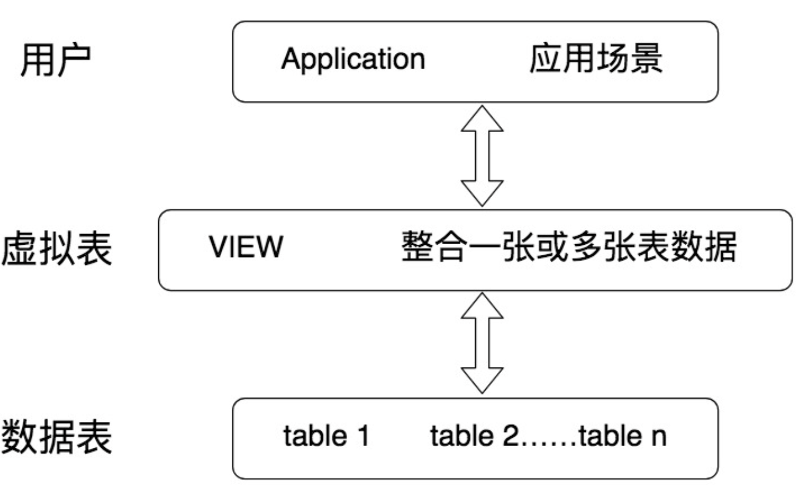

DB：数据库，存储数据的集合

DBMS：数据库管理系统，多个DB + 管理程序

DBS：数据库系统，更大的概念，包含DB、DBMS、DBA

RDBMS：关系型数据库，SQL就是关系型数据库的查询语言

NoSQL泛指非关系型数据库，如键值型Redis、文档型MongoDB、搜索引擎ES Splunk Solr、列存储、图数据库等

搜索引擎的核心原理是倒排索引，用来实现全文检索

列数据库：降低系统IO，适合分布式文件系统，但功能相对有限

ER Diagram：实体关系图，包含实体、属性、关系

### SQL

SQL：Structural Query Lanuage

SQL按照功能划分为四个部分

* DDL：数据定义语言，创建、删除、修改数据库或表结构
* DML：数据操作语言，如插入、删除、修改表记录
* DCL：数据控制语言，如控制访问权限和安全级别
* DQL：数据查询语言

规范：

* 表名、表别名、字段名、字段别名使用小写，字段名推荐下划线
* SQL保留字、函数、绑定变量等使用大写

### DDL

不需要COMMIT

CREATE  DROP  ALTER

ALTER TABLE player ADD （age int）

ALTER TABLE player MODIFY （age  bigint）

ALTER TABLE player DROP COLUMN age

ALTER TABLE player RENAME COLUMN age to play_age

表设计原则：简单可复用，简单指的是用更少的表、更少的字段、更少的联合主键字段来完成数据表的设计。可复用则是通过主键、外键的使用来增强数据表之间的复用率

- 键约束
    - 主键约束：NOT NULL + UNIQUE，一张表主键只能有一个，可以是一个字段，也可以是复合字段
    - 外键约束：确定表与表之间引用的完整性，一张表中的外键对应另一张表的逐渐，外键可以重复，可以为空
- 字段约束
    - UNIQUE约束：同时会创建普通索引（NORMAL INDEX）
    - NOT NULL约束
    - DEFAULT约束 
    - CHECK约束：CHECK（age >= 18 and age <= 70）

### DQL

SELECT [distinct] ... FROM ... WHERE ... GROUP BY ... HAVING ... ORDER BY ...

FROM > WHERE > GROUP BY > HAVING > SELECT 的字段 > DISTINCT > ORDER BY > LIMIT

SELECT可以查询列、常数、函数、子查询

ORDER BY可以使用不在SELECT中选择的字段排序   ASC   DESC

AS取别名

在知道返回结果只会有一个时 limit 1 可以提升查询效率 

表JOIN

1. 通过 CROSS JOIN 求笛卡尔积
2. 通过 ON 进行筛选
3. 如果我们使用的是左连接、右链接或者全连接，还会涉及到添加外部行

> 作者回复: 关于COUNT()的效率是一个很好的问题，欢迎探讨：
> 在MySQL InnoDB存储引擎中，COUNT(*)和COUNT(1)都是对的所有结果进行的COUNT。如果有WHERE子句，则是对所有符合筛选条件的数据行进行统计。如果没有WHERE子句，则是对数据表的数据行数进行统计。
> 因此COUNT(*)和COUNT(1)本质上没有区别，执行的复杂度都是O(N)，也就是采用全表扫描，进行循环+计数的方式进行统计。
> 如果是MySQL MyISAM存储引擎，统计数据表的行数只需要O(1)复杂度，这是因为每张MyISAM的数据表都有一个meta信息有存储了row_count值。而一致性由表级锁来保证。而InnoDB支持事务，采用行级锁和MVCC机制，所以无法像MyISAM一样，只维护一个row_count变量。因此就需要采用扫描全表，进行循环+计数的方式来完成统计。
> 需要注意的是，在实际执行中COUNT(*)和COUNT(1)执行时间可能略有差别，不过你还是可以把这两个在执行效率上看成是相等的。
>
> 另外在InnoDB引擎中，如果是采用COUNT(*)和COUNT(1)来统计数据行数，要尽量采用二级索引。
> 因为主键采用的索引是聚簇索引，聚簇索引包含的信息多，明显会大于二级索引（非聚簇索引）。
> 对于查找具体的行来说，采用主键索引效率更高。而对于COUNT(*)和COUNT(1)这种，不需要查找具体的行，只是统计行数来说，系统会自动采用占用空间更小的二级索引来进行统计。
> 如果有多个二级索引的时候，会使用key_len小的二级索引进行扫描。当没有二级索引的时候，才会采用主键索引来进行统计。
>
> 优化总结：
> 1、一般情况下：COUNT(*) = COUNT(1) > COUNT(字段)
> 所以尽量使用COUNT(*)，当然如果你要统计的是就是某个字段的非空数据行数，那另当别论。毕竟执行效率比较的前提是要结果一样才行。
> 2、如果要统计COUNT(*)，尽量在数据表上建立二级索引，系统会自动采用key_len小的二级索引进行扫描，这样当我们使用SELECT COUNT(*)的时候效率就会提升，有时候提升几倍甚至更高都是有可能的。
>
> 作者回复: 这是一个很好的问题，关于ORDER BY字段是否增加索引：
> 在MySQL中，支持两种排序方式：FileSort和Index排序。Index排序的效率更高，
> Index排序：索引可以保证数据的有序性，因此不需要再进行排序。
> FileSort排序：一般在内存中进行排序，占用CPU较多。如果待排结果较大，会产生临时文件I/O到磁盘进行排序，效率较低。
>
> 所以使用ORDER BY子句时，应该尽量使用Index排序，避免使用FileSort排序。
> 当然具体优化器是否采用索引进行排序，你可以使用explain来进行执行计划的查看。
> 优化建议：
> 1、SQL中，可以在WHERE子句和ORDER BY子句中使用索引，目的是在WHERE子句中避免全表扫描，ORDER BY子句避免使用FileSort排序。
> 当然，某些情况下全表扫描，或者FileSort排序不一定比索引慢。但总的来说，我们还是要避免，以提高查询效率。
> 一般情况下，优化器会帮我们进行更好的选择，当然我们也需要建立合理的索引。
> 2、尽量Using Index完成ORDER BY排序。
> 如果WHERE和ORDER BY相同列就使用单索引列；如果不同使用联合索引。
> 3、无法Using Index时，对FileSort方式进行调优。

#### SQL函数

算术函数

字符串函数

日期函数

转换函数

聚集函数：COUNT MAX MIN AVG SUM，MAX、MIN、AVG会忽略NULL

函数会导致不走索引，不要在WHERE中使用函数

#### WHERE过滤

and、or、not、between and、like、is null、in、算术比较

% ：零个或多个字符   _ ：一个字符 

like以%开头，即使有索引也会进行全表扫描，不以%开头且有索引，不会进行全表扫描

count(*) = count(1) > count(字段)   count(字段) 会忽略null

#### GROUP BY 和 HAVING

GROUP BY用于分组

HAVING用于分组过滤，WHERE用于数据行过滤

#### 子查询

关联子查询：循环执行

非关联子查询：只执行一次

EXISTS：子查询是否存在数据

IN：是否在集合中

ANY：和比较操作符一起用

ALL：和比较操作符一起用

在建立索引的情况下，EXISTS和IN效率

SELECT * FROM a WHERE x IN (SELECT x FROM b)

SELECT * FROM a WHERE EXISTS (SELECT x FROM b WHERE a.x = b.x)

若A表比B表大，使用IN，使用B表的索引

若A表比B表小，使用EXISTS，使用A表的索引

#### 表连接

##### 内连接

等值连接 / 自然连接

等值连接：将两张表先笛卡尔积，再进行等值比较

自然连接：将两个表中名称相同的字段进行等值比较

等值连接       SELECT * FROM a,b WHERE a.id = b.id

等值连接       SELECT * FROM a JOIN b ON a.id = b.id

自然连接       SELECT * FROM a NATURAL JOIN b

USING连接   SELECT * FROM a JOIN b USING(id)

非等值连接：用等号判断连接的就是等值连接，其余的判断条件就是非等值连接

自连接：同一张表连接

##### 外连接

左外连接：左边的表位主表，显示其全部行

SELECT * FROM a LEFT JOIN b ON a.id = b.id

右外连接：右边的表为主表，显示其全部行

SELECT * FROM a RIGHT JOIN b ON a.id = b.id

全外连接： 两边的表都显示其全部行

SELECT * FROM a FULL JOIN b ON a.id = b.id

Mysql不支持全外连接

##### 交叉连接 / 笛卡尔积

X表每一行和Y表每一行两两相连，结果集的数量为X * Y

SQL92    SELECT * FROM a,b

SQL99    SELECT * FROM a CROSS JOIN b

### DCL

### DML

### 视图

视图：虚拟表，相当于一张表或多张表的结果集

CREATE VIEW  viewname AS SELECT ...

ALTER VIEW viewname AS SELECT ...

DROP VIEW viewname

### 存储过程

### 事务

### 游标

