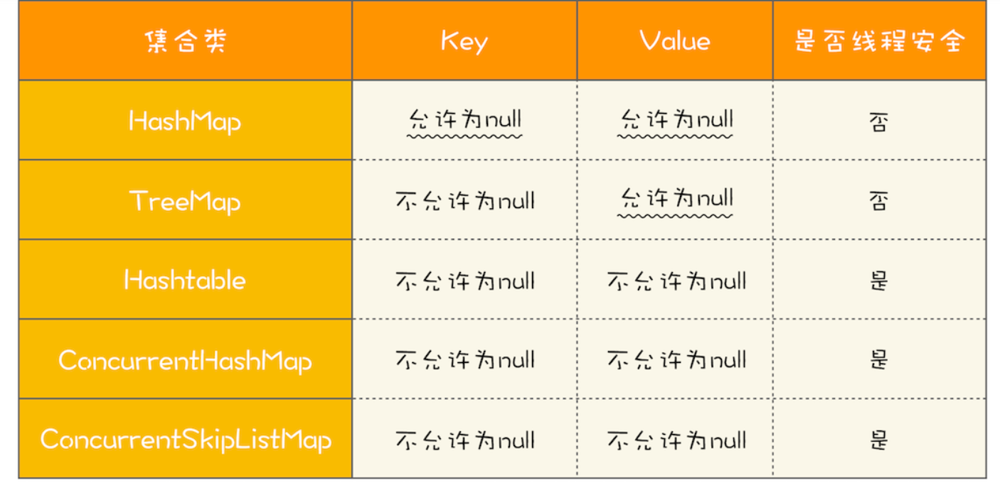

## 调优 HashMap

我们有可能手动调优HashMap以提高其在特定应用程序中的性能。为了理解调整HashMap时的性能问题，一些术语是必要的：

- 容量（Capacity）：表中存储的桶数量。
- 初始容量（Initial Capacity）：当表被创建时，桶的初始个数。 HashMap 和 HashSet 有可以让你指定初始容量的构造器。
- 个数（Size）：目前存储在表中的键值对的个数。
- 负载因子（Load factor）：通常表现为 $\frac{size}{capacity}$。当负载因子大小为 0 的时候表示为一个空表。当负载因子大小为 0.5 表示为一个半满表（half-full table），以此类推。轻负载的表几乎没有冲突，因此是插入和查找的最佳选择（但会减慢使用迭代器进行遍历的过程）。 HashMap 和 HashSet 有可以让你指定负载因子的构造器。当表内容量达到了负载因子，集合就会自动扩充为原始容量（桶的数量）的两倍，并且会将原始的对象存储在新的桶集合中（也被称为 rehashing）

HashMap 中负载因子的大小为 0.75（当表内容量大小不足四分之三的时候，不会发生 rehashing 现象）。这看起来是一个非常好的同时考虑到时间和空间消耗的平衡策略。更高的负载因子会减少空间的消耗，但是会增加查询的耗时。重要的是，查询操作是你使用的最频繁的一个操作（包括 `get()` 和 `put()` 方法）。

如果你知道存储在 HashMap 中确切的条目个数，直接创建一个足够容量大小的 HashMap，以避免自动发生的 rehashing 操作。

