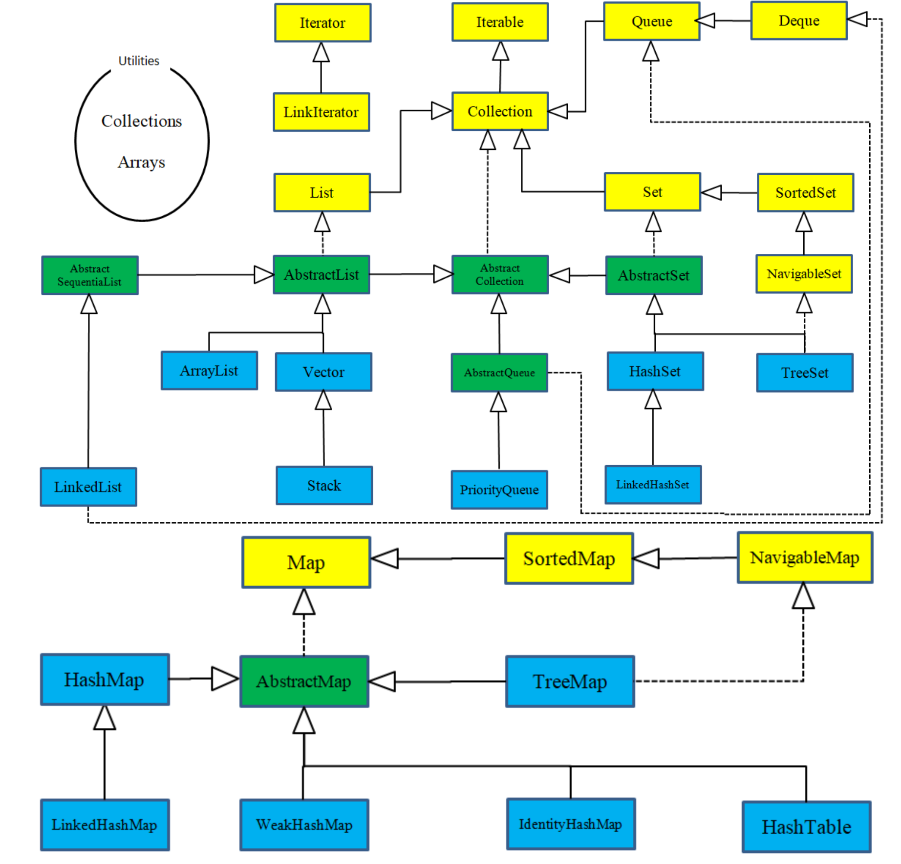

Java集合类库采用“持有对象”（holding objects）的思想，将其分为两个不同的概念，表示为类库的基本接口：

1. **集合（Collection）** ：一个独立元素的序列，这些元素都服从一条或多条规则
2. **映射（Map）** ： 一组成对的“键值对”对象，允许使用键来查找值

### List

以插入顺序保存元素

1. ArrayList：擅长随机访问元素，但在插入和删除元素时速度较慢。
2. LinkedList：它通过较低的代价进行插入和删除操作，提供了优化的顺序访问。 

**LinkedList** 具有比 **ArrayList** 更大的特征集(栈、队列、双端队列(deque))。

retainAll交集    removeAll差集    addAll补集

使用ArrayDeque实现堆栈功能

### Set

不能包含重复元素

* HashSet：底层HashMap
* LinkedHashSet：底层LinkedHashMap
* TreeSet：红黑树

### Queue

按照排队规则来确定对象产生的顺序

* ArrayDeque
* LinkedList

#### 优先级队列PriorityQueue

允许重复，最小的值有最大的优先级，使用堆实现

### 散列表

在Java中，散列表用链表数组实现，每个链表称为桶

对象计算散列码然后对桶总数取余，得到保存这个元素的桶的索引

在Java8中，桶满时会从链表转为平衡二叉树

装填因子决定什么时候对散列表进行再散列，默认装填因子0.75，意味表中超过75%的位置已经填入元素，这个表会以双倍的桶数进行再散列

### Map

* HashMap  
* WeakHashMap：创建一个WeakReference指向键，当垃圾收集器发现键只有这个弱引用时，将改弱引用放到队列中，WeakHashMap定时查看，并将添加进来的弱引用对应的键值对删除
* TreeMap
* LinkedHashMap
* IdentityHashMap：键的散列值通过对象地址计算，在实现对象遍历算法 (如对象串行化)时， 这个类非常有用， 可以用来跟踪每个对象的遍历状况

### Itreator

Java 的 **Iterator** 只能单向移动。

1. 使用 `next()` 方法获得序列中的下一个元素。
3. 使用 `hasNext()` 方法检查序列中是否还有元素。
4. 使用 `remove()` 方法将迭代器最近返回的那个元素删除。所以调用该方法前必须调用next()方法。  该方法是可选方法，这意味着并非所有的 **Iterator** 实现都必须实现该方法。但是，标准 Java 库集合实现了该方法

### ListItreator

**ListIterator** 是一个更强大的 **Iterator** 子类型，它只能由各种 **List** 类生成。 **Iterator** 只能向前移动，而 **ListIterator** 可以双向移动。

### Iterable

for-in 可接收数组或实现了Itreable接口的类

