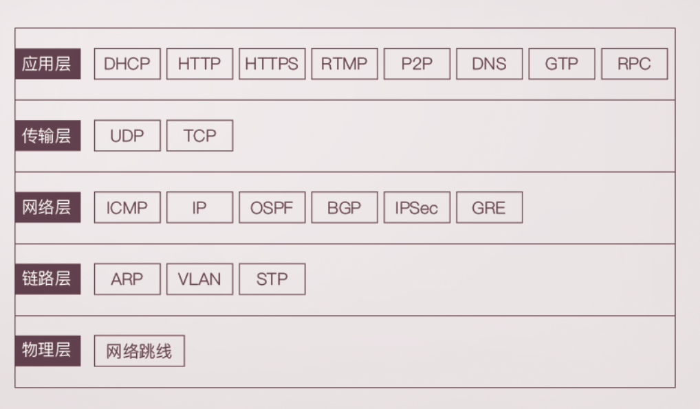
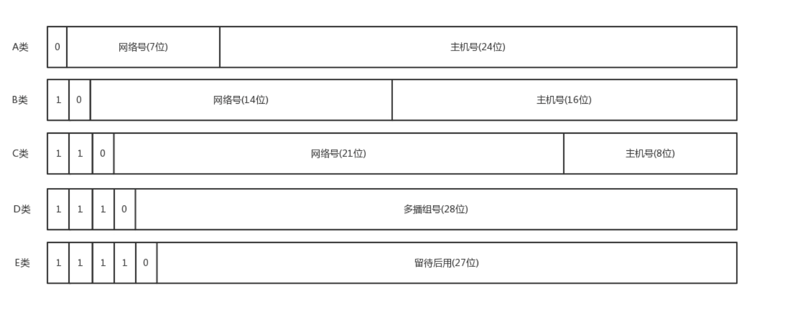
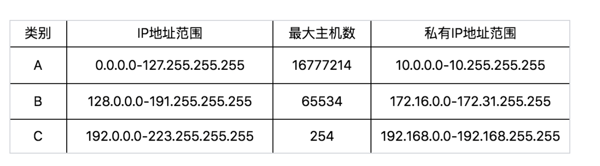

协议：

1. 语法
2. 语义
3. 顺序

只有通过网络协议，才能使机器相互协作，共同完成一件事

URL通过DNS或HTTPDNS协议拿到IP地址，通过HTTP或HTTPS协议传输数据

经过应用层封装后，浏览器将包交给下一层的传输层处理

传输层有两种协议，一种是无连接的协议**UDP**，一种是面向连接的协议**TCP**。所谓的面向连接就是，TCP会保证这个包能够到达目的地。如果不能到达，就会重新发送，直至到达。TCP 协议里面会有两个端口，一个是浏览器监听的端口，一个是电商的服务器监听的端口

传输层封装完毕后，浏览器会将包交给操作系统的**网络层**。网络层的协议是 IP 协议。在 IP 协议里面会有源 IP 地址和目标 IP 地址

要根据目标IP找到目标机器，需要判断IP是本地还是远程，如果是远程，需要走网关，默认DHCP会配置默认网关为192.168.1.1，通过ARP协议获取网关的MAC地址，链路层包括本机MAC地址和网关MAC地址

最后通过网卡将包发送至网关

网关收到包后，获取IP头，根据路由表获取到某个IP怎么走，常见的路由协议由OSPF和BGP

走到最后一个网关后，网关根据IP获取MAC地址，根据MAC地址就能找到目标服务器

目标服务器收到包后，先判断MAC地址，匹配之后取下MAC头，交给网络层判断IP地址，匹配之后取下IP头，交给传输层，对于TCP协议，对于收到的每个包，都会回复一个说明收到的包，经过三次握手，TCP连接成功，根据TCP头中的目标端口，找到监听该端口的进程。操作系统进程间通信往往通过RPC调用，即远程过程调用，RPC 框架有很多种，有基于 HTTP 协议放在 HTTP 的报文里面的，有直接封装在 TCP 报文里面的。最后，进程回复一个HTTP包

只要是在网络上跑的包，都是完整的。可以有下层没上层，绝对不可能有上层没下层。

### 地址

ifconfig、ip addr

inet：ipv4

inet6：ipv6

ether：mac

MTU：最大传输单元，以字节为单位

#### IP

lo 全称是**loopback**，又称**环回接口**，往往会被分配到 127.0.0.1 这个地址。这个地址用于本机通信，经过内核处理后直接返回，不会在任何网络中出现

#### CIDR(无类型域间选路)

将 32 位的IP地址一分为二，前面是网络号，后面是主机号，ip后面的/24表示网络号为前24位

广播地址：将IP的主机号全改为1的地址

子网掩码：网络号全为1，主机号全为0的地址

CIDR可用于判断两个IP是否在同一子网

#### MAC地址

网卡的物理地址，唯一

在同一个子网内可以通过MAC地址通信，但对于不同子网，需要使用IP地址

可以将IP理解为地址，MAC地址理解为身份证

为什么路由表获取IP后还要获取MAC地址

路由协议中下一站的IP放在哪

二层设备、三层设备、四层 LB 和七层 LB 中层

所谓的二层设备、三层设备，都是这些设备上跑的程序不同而已。一个 HTTP 协议的包经过一个二层设备，二层设备收进去的是整个网络包。这里面 HTTP、TCP、 IP、 MAC 都有。什么叫二层设备呀，就是只把 MAC 头摘下来，看看到底是丢弃、转发，还是自己留着。那什么叫三层设备呢？就是把 MAC 头摘下来之后，再把 IP 头摘下来，看看到底是丢弃、转发，还是自己留着。

从你的电脑，通过 SSH 登录到公有云主机里面，都需要经历哪些过程？或者说你打开一个电商网站，都需要经历哪些过程？

net-tools 和 iproute2 的故事？

