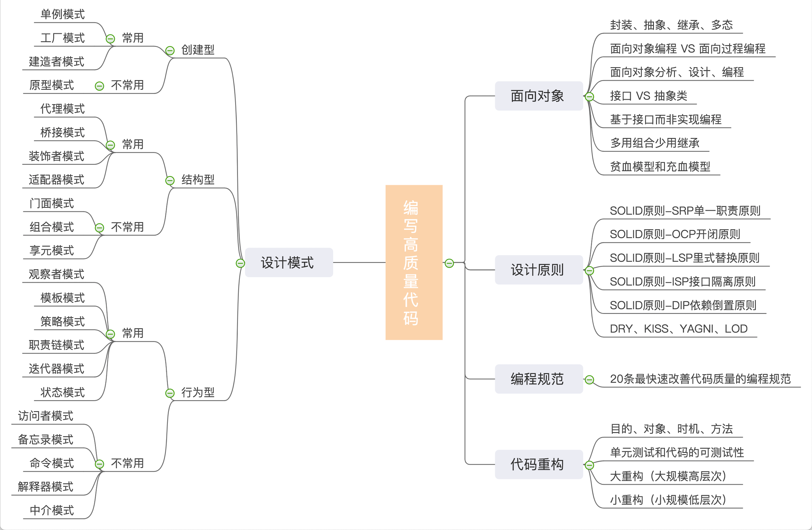

### 如何编写高质量的代码

编程范式：主流的有面向过程、面向对象、函数式编程，面向对象又是其中最主流的，拥有封装、继承、多态等丰富的特性，可以实现很复杂的设计思路，是很多设计原则和设计模式编码实现的基础

设计原则：指导我们代码设计的经验总结

设计模式：针对常见的设计问题，总结出的解决方案或设计思路。主要解决可扩展性

编程规范：解决代码的可读性问题，比如变量函数类的命名、代码注释、函数不宜过长、函数参数不宜过多

代码重构：保持代码质量不下降，重构的工具就是面向对象设计思想、设计原则、设计模式和编码规范，而这些思想原则规范最重要的使				   用场景就是重构，在开发初期，不要过度设计，出现问题的时候，再持续进行重构

设计模式要干的事情就是解耦，创建型模式是将创建和使用代码解耦，结构型模式是将不同功能代码解耦，行为型模式是将不同的行为代码解耦。借助设计模式，我们利用更好的代码结构，将一大坨代码拆分成职责更单一的小类，让其满足开闭原则、高内聚低耦合等特性，以此来控制和应对代码的复杂性，提高代码的可扩展性

### 代码质量维度

1. 可维护性：在不破坏原有代码设计、不引入新的bug的情况下，能快速修改或添加代码

2. 可扩展性：不修改或少量修改原有代码的情况下，通过扩展的方式添加新的功能代码

3. 可测试性：单元测试

4. 可复用性：减少编写重复代码，复用已有代码   DRY原则  Don't repeat yourself

5. 可读性：人能理解的代码，命名规范、高内聚低耦合、注释、模块划分

6. 灵活性：易扩展，易复用

7. 简洁性：KISS原则  Keep it simple，stupid

最常提高代码可扩展性的方法有：多态、依赖注入、基于接口而非实现、大部分设计模式

### 代码规范

Google Java Style Guide

Alibaba Java Code Style

#### 命名和注释

长度，利用上下文简化命名

名称可读、可搜索，统一命名规约，eg：selectXXX or queryXXX

注释要说明做什么、为什么、怎么做

类和函数一定要写注释

#### 代码风格

函数代码最好不要超过一个屏幕

函数参数不宜过多

一行代码不要超过显示器显示的宽度

对较长的函数，善用空格分割块

不用tab缩进

静态变量--->非静态变量--->静态方法--->非静态方法

public--->protected--->default--->private

