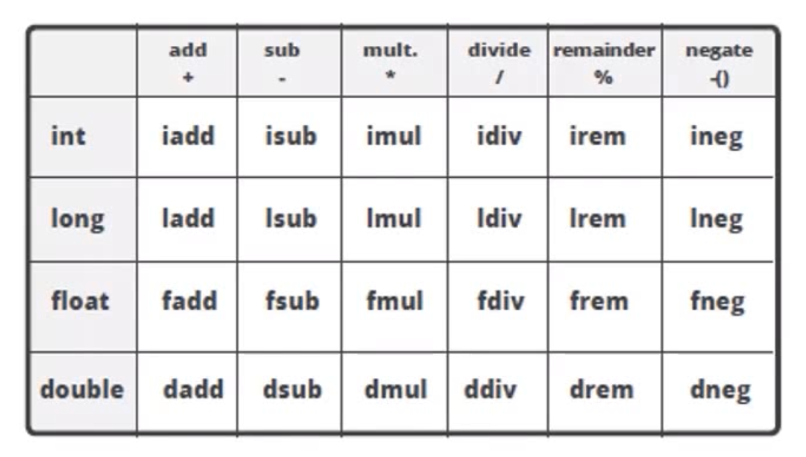
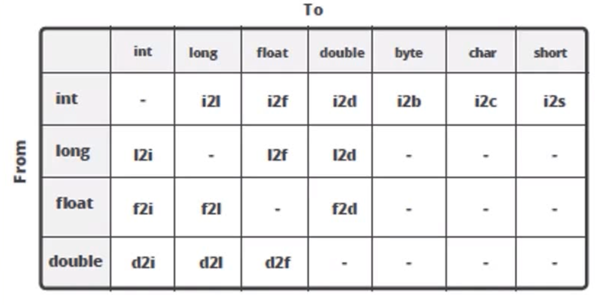

### 字节码

Java字节码由单字节的指令组成，理论上最多有256个操作码，但只使用了200多个，其余的留给调试

1. 栈操作指令，包括与局部变量交互的指令
2. 程序流程控制指令
3. 对象操作指令，包括方法调用指令
4. 算术运算以及类型转换指令

load：从局部变量表加载到栈，store：从栈保存至局部变量表    a、i、l、f、d：分别表示引用、int、long、float、double

当int取值-1~5采用iconst指令，取值-128~127采用bipush指令，取值-32768~32767采用sipush指令，取值-2147483648~2147483647采用 ldc 指令，在JVM中，对boolean、byte、short、char的操作，都会转为int操作

invokeStatic：调用类的静态方法，是方法调用中最快的

invokeSpecial：调用构造函数、同一个类中的private方法、可见的超类方法

invokeVirtual：如果是具体类型的目标对象，用于调用public、protected、default的方法

invokeInterface：当通过接口引用调用方法时

invokeDynamic：JDK7新增指令，是实现动态语言支持的升级，也是JDK8中支持lambda的实现基础

### 基本数据类型

基本数据类型当作局部变量时，其占用的空间等于其Slot的大小。而基本数据类型出现在字段中或数组元素中，其大小等于其值域

在HotSpot中，boolean字段占用一个字节，boolean数组使用byte数组实现，为了保证其合法性，HotSpot在对其存储时显示进行掩码操作，只取最后一位的值放入字段或数组中

在从局部变量表加载到操作数栈时，boolean、char、byte、short会进行扩展，其中boolean和char是无符号的，在高位补0，byte和short在高位补符号位

### JVM参数

以-开头为标准参数，所有JVM要实现并保证向后兼容，如-server，-client

以-D 设置系统属性

以-X开头为非标准参数，不保证向后兼容和所有JVM都实现，使用java -X查看可用参数

以-XX:开头，为非稳定参数，用于控制JVM行为，和具体JVM实现有关，随时可能在下个版本取消

分类：

* 系统属性参数
* 运行模式参数
* 堆内存设置参数
* GC设置参数
* 分析诊断参数
* JavaAgent参数

-Xms  堆内存初始大小，指定的内存大小，并不是操作系统实际分配的初始值，而是GC先规划好，用到才分配

-Xmx  最大堆内存，默认空余堆内存小于40%时，JVM就会增大堆直到-Xmx的最大限制；空余堆内存大于70%时，JVM会减少堆直到

​	 	  -Xms的最小限制

-Xmn  年轻代大小，等价于 -XX:NewSize，使用G1垃圾收集器不应该设置该选项。官方建议设置为 -Xmx 的 1/2 ~ 1/4

-Xss    设置每个线程栈的字节数

-XX:NewRatio  设置年轻代(包括Eden和两个Survivor区)与年老代的比值

-XX:SurvivorRatio  设置年轻代中Eden区与Survivor区的大小比值

-XX:MaxMetaspaceSize  设置元空间最大值

-XX:MetaspaceSize  设置元空间初始值

-XX:MinMetaspaceFreeRatio  -XX:MaxMetaspaceFreeRatio 设置元空间最小或最大剩余容量的百分比

-XX:MaxDirectMemorySize，系统可以使用的最大堆外内存，默认与Java堆最大值一致

-XX:+HeapDumpOnOutOfMemoryError

-XX:HeapDumpPath

-XX:+UseG1GC:使用 G1 垃圾回收器 

-XX:+UseConcMarkSweepGC:使用 CMS 垃圾回收器 

-XX:+UseSerialGC:使用串行垃圾回收器 

-XX:+UseParallelGC:使用并行垃圾回收器

-XX:+UnlockExperimentalVMOptions -XX:+UseZGC

-XX:+UnlockExperimentalVMOptions -XX:+UseShenandoahGC

-Xdebug -Xrunjdwp:transport=dt_socket,server=y,suspend=n,address=1506，远程调试

### 命令行工具

| 命令      | 说明                          | 常用选项                |
| --------- | ----------------------------- | ----------------------- |
| jps/jinfo | 查看Java进程                  |                         |
| jstat     | 查看JVM内部GC信息             | -gc   -gcutil       pid |
| jmap      | 查看heap或类占用空间统计      | -heap   -histo   pid    |
| jstack    | 查看线程信息                  | pid -l                  |
| jcmd      | 执行JVM相关分析命令(整合命令) | pid help                |
| jhsdb     |                               |                         |

