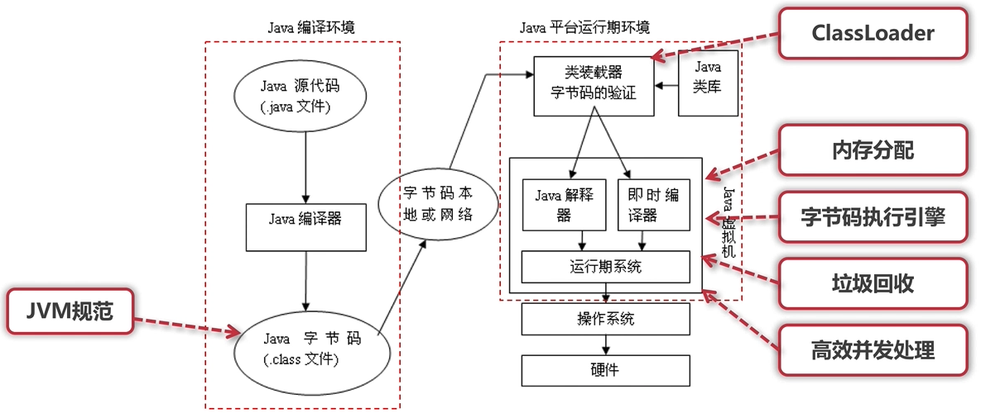

### 为什么要使用虚拟机

平台无关

语言无关

托管环境

帮我们处理易于出错的代码，如内存管理、垃圾回收等，不易出现内存泄漏和内存溢出，提供数组越界、动态类型、安全权限等等的动态检测

### 编译

将字节码翻译为机器码有两种方式，解释执行和即时编译JIT，HotSpot采用混合策略，先解释执行字节码，将其中反复执行的热点代码，以方法为单位进行即时编译

为了满足不同场景的需求，在编译时间和代码执行效率之间做取舍，HotSpot内置了多个即时编译器，C1、C2和Graal(Java10引入)

C1又叫做Client编译器，面向的是对启动性能有要求的程序，优化手段相对简单，编译时间短，C2又叫做Server编译器，面向的是对峰值性能有要求的程序，优化手段复杂，编译时间较长，代码执行效率高

从Java7开始，HotSpot默认采用分层编译，热点代码先被C1编译，而后热点方法中的热点进一步被C2编译

即时编译被放在额外的线程中执行，HotSpot会根据CPU的数量设置编译线程的数目，并按1：2分配给C1和C2

#### AOT

