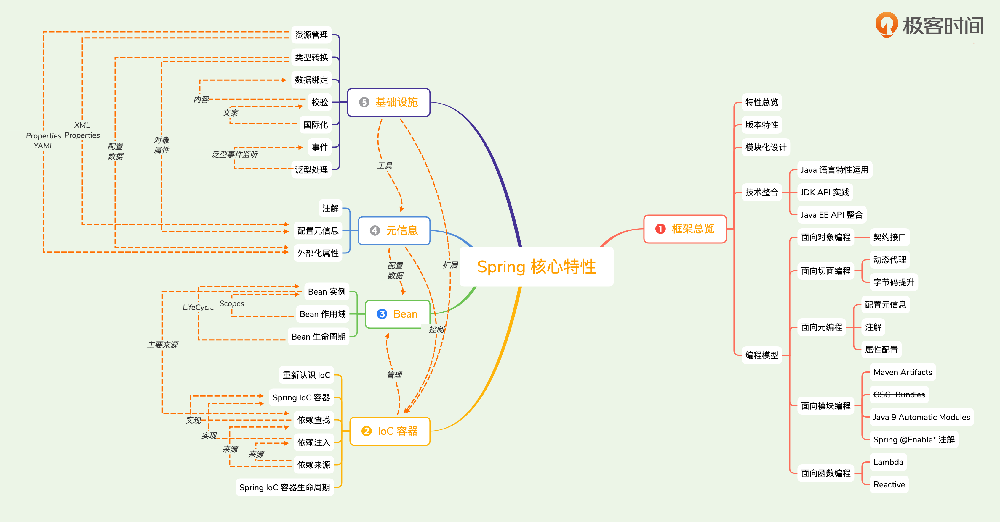

### 核心特性

1. IOC
2. AOP
3. i18n
4. Events
5. Resources
6. Validation
7. Data Binding
8. Type Conversion
9. Spring EL

### 数据存储

1. JDBC
2. 事务抽象
3. DAO支持
4. O/R Mapping
5. XML Marshalling

### Web

* Servlet
    * MVC
    * WebSocket
    * SockJS
* Reactive
    * WebFlux
    * WebClient
    * WebSocket

### 技术整合

1. 远程调用
2. JMS
3. JMX
4. JCA
5. 本地任务Tasks
6. 本地调度Scheduling
7. 缓存抽象Caching
8. 测试
9. Java邮件客户端Email

### 测试

* Mock Objects
* TextContext Framework
* SpringMVC Test
* WebTestClient

### IOC容器职责

* 依赖处理
    * 依赖查找
    * 依赖注入

* 生命周期管理
    * 容器
    * 托管的资源
* 配置
    * 容器
    * 托管的资源
    * 外部化配置

### BeanFactory和ApplicationContext

BeanFactory提供了先进的配置机制，能管理所有类型的对象

ApplicationContext除了提供IOC能力，还提供了更多企业特性

BeanFactory不对配置格式或注解做限制，而是通过BeanDefinitionReader或BeanPostProcessor进行扩展

ApplicationContext既继承了BeanFactory，内部又组合了一个BeanFactory实例

BeanFactory Bean是延迟加载，ApplicationContext会将单例Bean提前初始化

BeanPostProcessor和BeanFactoryPostProcessor，BeanFactory需要手动注册，ApplicationContext则是自动注册

### 模块

ioc

* spring-core 资源管理、泛型处理等
* spring-beans 依赖查找、依赖注入相关
* spring-context 应用上下午相关，注解驱动、事件驱动、模块驱动等
* spring-expression  Spring表达式相关
* spring-context-support 提供Cache、Mail、Schedule等支持
* spring-context-indexer

aop

* spring-aop  Spring AOP处理
* spring-aspects  与AspectJ整合

web

* spring-web
* spring-webmvc
* spring-webflux
* spring-websocket

data access

* spring-tx
* spring-jdbc
* spring-r2dbc
* spring-orm

message

* spring-jms
* spring-messaging

logging

* spring-jcl

test

* spring-test

javaagent

* spring-instrument

xml marshal

* spring-oxm

