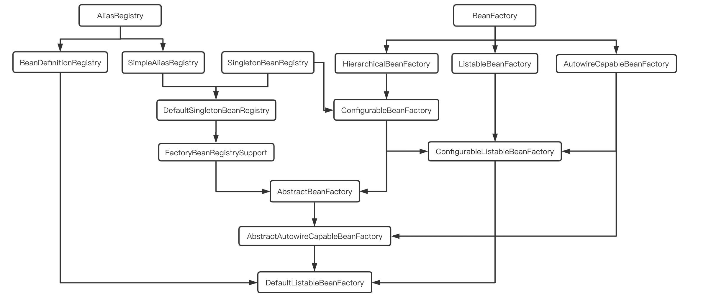

### BeanDefinition

1. 类全名，通常是具体类
2. Bean行为配置，如生命周期回调、作用域、延迟初始化
3. Bean依赖
4. 属性配置，如线程池大小、连接数等

BeanNameGenerator

BeanDefinitionHolder

Bean属性元信息：PropertyValues

* 可变实现：MutablePropertyValues
* 内部元素：PropertyValue

Bean附加信息：

* AttributeAccessor：BeanDefinition的辅助信息

* BeanMetadataElement：BeanDefinition的Source

### BeanDefinition注册及实例化Instantiation

1. XML

    \<bean constructor-arg /\>

    \<bean class = ""   factory-method="" /\>

    \<bean factory-bean=""  factory-method="" /\>

2. 注解

    @Component

    @Bean

    @Import

3. API

    BeanDefinitionRegistry#registerBeanDefinition

    BeanDefinitionReaderUtils#registerWithGeneratedName

    AnnotatedBeanDefinitionReader#register

FactoryBean：实现复杂初始化逻辑

ServiceLoaderFactoryBean、ServiceFactoryBean、ServiceListFactoryBean

特殊方式（非BeanDefinition模式）
* AutowireCapableBeanFactory#createBean
* SingletonBeanRegistry#registerSingleton

### Bean初始化Initialization

* @PostConstruct
* 实现InitializingBean接口的afterPropertiesSet方法
* 自定义
    * XML  \<bean init-method="  " />
    * Java注解   @Bean(initMethod="")
    * Java API  AbstractBeanDefinition#setInitMethodName

多种方式指定同一个方法，只会执行一次

### Bean销毁Destroy

* @PreDestory
* 实现DisposableBean接口的destory方法
* 自定义
    * XML \<bean destory-method="" />
    * 注解  @Bean(destoryMethod="")
    * API   AbstractBeanDefinition#setDestoryMethodName

多种方式指定同一个方法，只会执行一次

### Bean延迟初始化

@Lazy     \<bean lazy-init="true" /\>

### Bean Scope

1. singleton     默认，一个容器上下文有且只有一个实例
2. prototype   每次依赖查找或注入生成一个新的Bean
3. request       ServletRequest上下文      RequestScope
4. session        HttpSession上下文           SessionScope
5. application  ServletContext上下文      ServletContextScope
6. websocket

request、session、application主要用于模版引擎，Bean被CGLIB代理

prototype的bean的销毁生命周期回调不会由容器管理

实现Scope接口自定义作用域，如ThreadLocal作用域

### 扩展点

Ordered接口或@Order，定义优先级，PriorityOrdered是Ordered的扩展，实现该接口的组件永远比实现Ordered接口的组件优先级高

BeanPostProcessor：通常用来检查接口回调，或用代理包装bean对象

手动注册的BeanPostProcessor不遵循Order，且永远比自动检测到的BeanPostProcessor先执行，手动注册的执行顺序和注册顺序一致

BeanFactoryPostProcessor

Bean(Factory)PostProcessor设置lazy-init会被忽略

### Bean生命周期

#### BeanDefinition元信息配置

面向资源：XML、Properties、Groovy

面向注解：@Componet、@Bean

面向API：BeanDefinitionBuilder / AbstractBeanDefinition

#### BeanDefinition元信息解析 

面向资源：BeanDefinitionReader------------>BeanDefinitionParser  

面向注解：AnnotatedBeanDefinitionReader

#### BeanDefinition注册

BeanDefinitionRegistry#registerBeanDefinition

#### BeanDefinition合并

ConfigurableBeanFactory#getMergedBeanDefinition

#### Bean Class加载

AbstractBeanFactory#resolveBeanClass

#### Bean实例化

* 实例化前
    * InstantiationAwareBeanPostProcessor#postProcessBeforeInstantiation
* 实例化
    * 实例化策略：InstantiationStrategy
    * 构造器依赖注入
* 实例化后
    * MergedBeanDefinitionPostProcessor#postProcessMergedBeanDefinition
    * InstantiationAwareBeanPostProcessor#postProcessAfterInstantiation

#### Bean属性赋值

* 赋值前
    * Spring5.0 InstantiationAwareBeanPostProcessor#postProcessPropertyValues
    * Spring5.1 InstantiationAwareBeanPostProcessor#postProcessProperties
* 赋值

#### Aware回调

* BeanFactory
    * BeanNameAware
    * BeanClassLoaderAware
    * BeanFactoryAware
* ApplicationContext       ApplicationContextAwareProcessor#postProcessBeforeInitialization
    * EnvironmentAware
    * EmbeddedValueResolverAware
    * ResouceLoaderAware
    * ApplicationEventPublisherAware
    * MessageSourceAware
    * ApplicationContextAware

#### Bean初始化

* 初始化前
    * BeanPostProcessor#postProcessBeforeInitialization
        * @PostConstruct    CommonAnnotationBeanPostProcessor#postProcessBeforeInitialization
* 初始化
    * InitializingBean
    * 自定义初始化方法

* 初始化后
    * BeanPostProcessor#postProcessAfterInitialization
* 初始化完成
    * Spring4.1 SmartInitializingSingleton#afterSingletonsInstantiated

#### Bean销毁

* 销毁前
    * DestructionAwareBeanPostProcessor#postProcessBeforeDesturction
        * @PreDestroy    CommonAnnotationBeanPostProcessor#postProcessBeforeDesturction
* 销毁
    * DisposableBean
    * 自定义销毁方法

