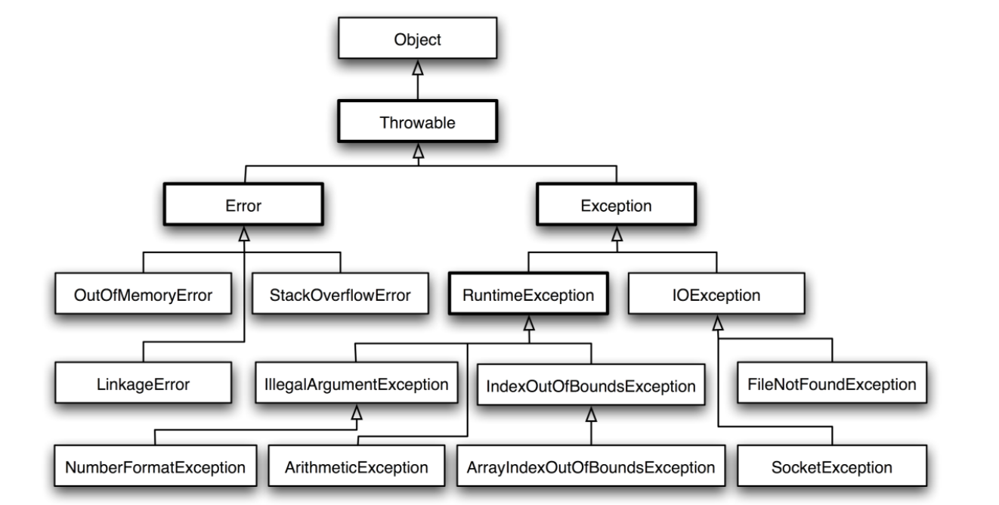

# 异常

实现了AutoCloseable接口：try-with-resources

Closeable继承自AutoCloseable

finally有return时，返回finally中的返回值

finally没有return时，若finall对try或catch中的返回值进行了修改，若返回值是基本类型则不变，如返回值是引用类型，返回的是对象，而非对象引用，也就是说，将对象引用指向了新的对象，返回的对象不变，通过对象引用修改对象，返回的对象内容变化

