### 为什么要使用并发编程

提升程序性能、提升资源利用率

### 分工、同步、互斥

所谓**分工**指的是如何高效地拆解任务并分配给线程，而**同步**指的是线程之间如何协作，**互斥**则是保证同一时刻只允许一个线程访问共享资源。

工作中遇到的线程协作问题，基本上都可以描述为这样的一个问题：**当某个条件不满足时，线程需要等待，当某个条件满足时，线程需要被唤醒执行**。在 Java 并发编程领域，解决协作问题的核心技术是**管程**，其还能用于解决互斥问题，管程是并发编程领域的万能钥匙

分工、同步主要强调的是性能，但还有一部分是关于“**线程安全**”，即可见性问题 原子性问题 有序性问题，解决方案就是互斥

**所谓互斥，指的是同一时刻，只允许一个线程访问共享变量。**实现互斥的核心技术就是锁

要理解可见性，就需要了解一些 CPU 和缓存的知识；要理解原子性，就需要理解一些操作系统的知识；很多无锁算法的实现往往也需要理解 CPU 缓存。

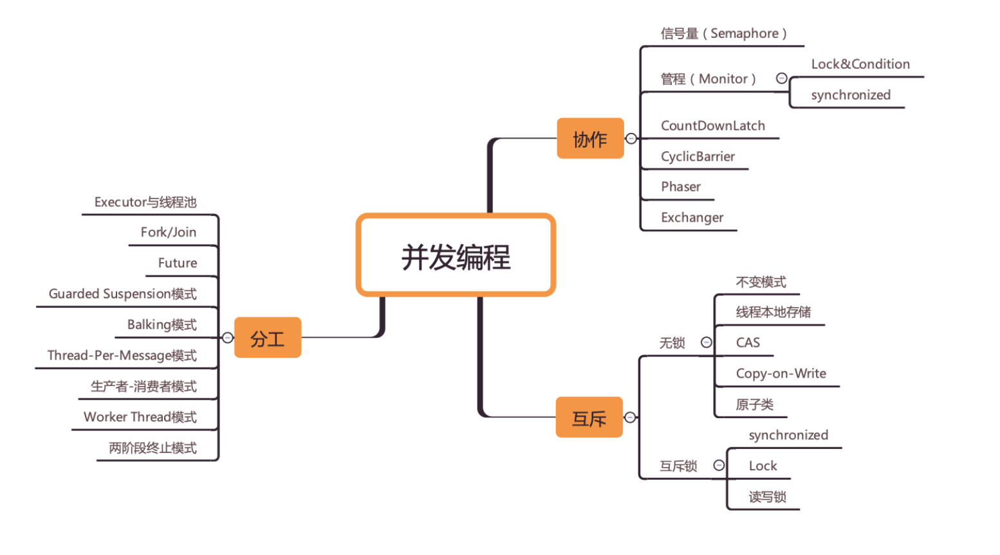

### 并发编程问题起源

CPU、内存、IO设备之间的速度差异，为了合理利用 CPU 的高性能，平衡这三者的速度差异，计算机体系机构、操作系统、编译程序都做出了贡献，主要体现为：

1. CPU 增加了缓存，以均衡与内存的速度差异；
2. 操作系统增加了进程、线程，以分时复用 CPU，进而均衡 CPU 与 I/O 设备的速度差异；
3. 编译程序优化指令执行次序，使得缓存能够得到更加合理地利用。

#### 缓存导致的可见性问题

多核时代，每颗 CPU 都有自己的缓存， CPU 缓存与内存的数据一致性就没那么容易解决了，当多个线程在不同的 CPU 上执行时，这些线程操作的是不同的 CPU 缓存。一个线程对共享变量的修改，另外一个线程能够立刻看到，称为**可见性**。

#### 线程切换导致的原子性问题

操作系统做任务切换，可以发生在任何一条**CPU 指令**执行完，而不是高级语言里的一条语句。**一个或者多个操作在 CPU 执行的过程中不被中断的特性称为原子性**。

#### 编译优化导致的有序性问题

我们以为的 new 操作应该是：

1. 分配一块内存 M；
2. 在内存 M 上初始化 Singleton 对象；
3. 然后 M 的地址赋值给 instance 变量。

但发生指令重排后，可能顺序是1->3->2

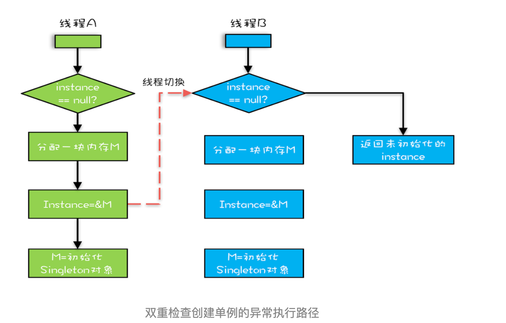

### Java内存模型

JSR133，明确规范了不同线程之间，通过哪些方式，在什么时候可以看到其它线程保存到共享变量的值，以及在必要时，如何对共享变量的访问进行同步，屏蔽了硬件平台和操作系统之间的内存访问差异，实现Java并发程序的跨平台

Java 内存模型规范了 JVM 如何提供**按需禁用缓存和编译优化**的方法，也就是解决可见性和有序性问题

这些方法包括**volatile**、**synchronized** 和 **final** 三个关键字，以及 **Happens-Before 规则**。

volitile：禁止CPU缓存，必须从内存中读取或者写入，防止指令重排

#### happens before原则

**前面一个操作的结果对后续操作是可见的**

1. 程序的顺序性规则

    这条规则是指在一个线程中，按照程序顺序，前面的操作 Happens-Before 于后续的任意操作。

2. volitile变量规则

    这条规则是指对一个 volatile 变量的写操作， Happens-Before 于后续对这个 volatile 变量的读操作。

3. 传递性规则

    这条规则是指如果 A Happens-Before B，且 B Happens-Before C，那么 A Happens-Before C。

4. 管程中锁的规则

    这条规则是指对一个锁的解锁 Happens-Before 于后续对这个锁的加锁。

5. 线程start规则

    它是指主线程 A 启动子线程 B 后，子线程 B 能够看到主线程在启动子线程 B 前的操作。

6. 线程join规则

    它是指主线程 A 等待子线程 B 完成（主线程 A 通过调用子线程 B 的 join() 方法实现），当子线程 B 完成后（主线程 A 中 join() 方法返回），主线程能够看到子线程的操作。

7. 线程中断规则
8. 对象终结规则

### 互斥

原子性问题的根本是线程切换，操作系统做线程切换依赖CPU中断

根本解决方案是同一时刻只有一个线程执行，即互斥

一段需要互斥执行的代码称为**临界区**

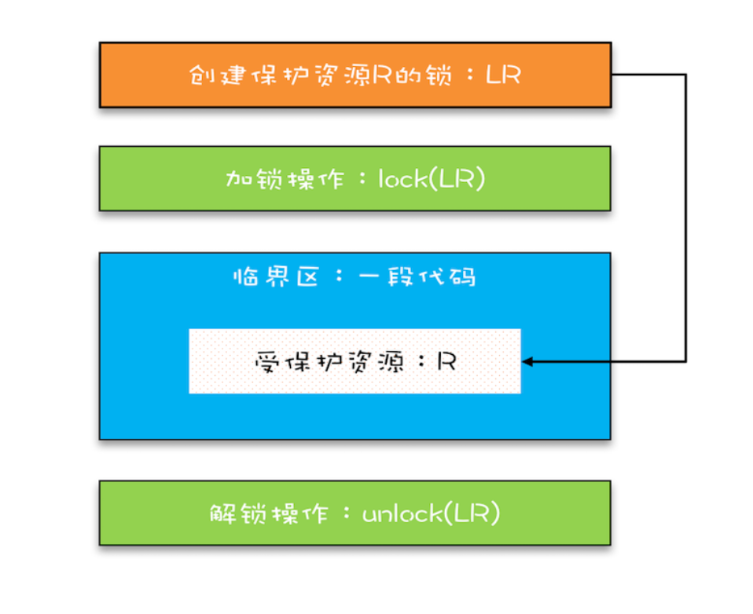

synchronized修饰静态方法，对Class加锁，修饰非静态方法，对this加锁

用不同的锁对受保护资源进行精细化管理，能够提升性能，这种锁也叫细粒度锁

不能用可变对象做锁

“原子性”的本质是什么？其实不是不可分割，不可分割只是外在表现，其本质是多个资源间有一致性的要求，操作的中间状态对外不可见。解决原子性问题，是要保证中间状态对外不可见。

#### 死锁

一组互相竞争资源的线程因互相等待，导致“永久”阻塞的现象

只有以下这四个条件都发生时才会出现死锁：

1. 互斥，共享资源 X 和 Y 只能被一个线程占用；
2. 占有且等待，线程 T1 已经取得共享资源 X，在等待共享资源 Y 的时候，不释放共享资源 X；
3. 不可抢占，其他线程不能强行抢占线程 T1 占有的资源；
4. 循环等待，线程 T1 等待线程 T2 占有的资源，线程 T2 等待线程 T1 占有的资源，就是循环等待。

#### 等待通知机制

一个完整的等待 - 通知机制：线程首先获取互斥锁，当线程要求的条件不满足时，释放互斥锁，进入等待状态；当要求的条件满足时，通知等待的线程，重新获取互斥锁

每个互斥锁由自己的等待队列，wait、notify、notifyAll方法只能在临界区使用，且调用对象必须为加锁的对象

notify() 是会随机地通知等待队列中的一个线程，而 notifyAll() 会通知等待队列中的所有线程

### 主要问题

#### 安全性问题

什么是线程安全？其实本质上就是正确性，而正确性的含义就是程序按照我们期望的执行

什么时候要分析安全性问题？ 当**存在共享数据并且该数据会发生变化，通俗地讲就是有多个线程会同时读写同一数据**。那如果能够做到不共享数据或者数据状态不发生变化，也能够保证线程的安全性

当多个线程同时访问同一数据，并且至少有一个线程会写这个数据的时候，如果不采取防护措施，就会导致并发问题，称为**数据竞争**（Data Race）所谓竞态条件Race Condition，指的是程序的执行结果取决于运行时对线程操作的交替执行的方式

#### 活跃性问题

某个操作无法执行下去

死锁：线程互相等待，永久阻塞

活锁：线程没有阻塞，但却无法执行下去。如两人迎面相遇，互相谦让

解决方案：尝试等待一个随机时间。分布式一致性算法Raft中也用到了这个思想

饥饿：线程因无法访问所需资源而无法执行下去。如果线程优先级“不均”，在 CPU 繁忙的情况下，优先级低的线程得到执行的机会很小，就可能发生线程“饥饿”；持有锁的线程，如果执行的时间过长，也可能导致“饥饿”问题

解决方案：保证资源充足；公平分配资源；避免有锁的线程长时间执行。一三应用场景有限，二应用场景更多。主要使用公平锁来公平分配资源，即先来后到，线程的等待是有顺序的，排在等待队列前面的线程会优先获得资源。

#### 性能问题

虽说锁解决了安全性问题，但同时也带来了性能问题

阿姆达尔公式：计算采用并行计算的提升的效率
$$
\frac{1}{(1-p)+\frac{p}{n}}
$$
p表示并行百分比，n表示CPU核数

解决方案

1. 采用无锁的算法和数据结构。如线程本地存储 (Thread Local Storage, TLS)、写入时复制 (Copy-on-write)、乐观锁等；JUC里面的原子类也是一种无锁的数据结构；Disruptor 则是一个无锁的内存队列
2. 减少锁的持有时间。如使用细粒度的锁，一个典型的例子就是 Java 并发包里的 ConcurrentHashMap，它使用了所谓分段锁的技术；还可以使用读写锁（ReadWriteLock、StampedLock ），读不加锁，写加锁

性能方面的度量指标有三个非常重要，就是：吞吐量、延迟和并发量。

1. 吞吐量：指的是单位时间内能处理的请求数量。吞吐量越高，说明性能越好。
2. 延迟：指的是从发出请求到收到响应的时间。延迟越小，说明性能越好。
3. 并发量：指的是能同时处理的请求数量，一般来说随着并发量的增加、延迟也会增加。所以延迟这个指标，一般都会是基于并发量来说的。例如并发量是 1000 的时候，延迟是 50 毫秒。

在并发编程领域，提升性能本质上就是提升硬件的利用率，具体来说，就是提升 I/O 的利用率和 CPU 的利用率

提升性能----->降低延迟，提高吞吐量----->优化算法、提高资源利用率

CPU密集型场景最佳线程数 = CPU 核数  + 1

IO密集型场景最佳线程数 = CPU 核数 * [ 1 +（I/O 耗时 / CPU 耗时）]

### 管程

**管程Monitor**是一种通用的同步原语，是解决并发问题的万能钥匙，也翻译为监视器

用信号量能解决所有并发问题，但Java 采用的是管程技术，synchronized 关键字及 wait()、notify()、notifyAll() 这三个方法都是管程的组成部分。**管程和信号量在逻辑是等价的，所谓等价指的是用管程能够实现信号量，也能用信号量实现管程**。

所谓**管程，指的是管理共享变量以及对共享变量的操作过程，让他们支持并发**。翻译为 Java 领域的语言，就是管理类的成员变量和成员方法，让这个类是线程安全的。

#### MESA模型

并发编程领域，有两大核心问题：一个是**互斥**，即同一时刻只允许一个线程访问共享资源；另一个是**同步**，即线程之间如何通信、协作。

管程解决互斥问题的思路很简单，就是将共享变量及其对共享变量的操作统一封装起来。

管程解决同步问题

管程引入了条件变量，每个条件变量对应一个等待队列

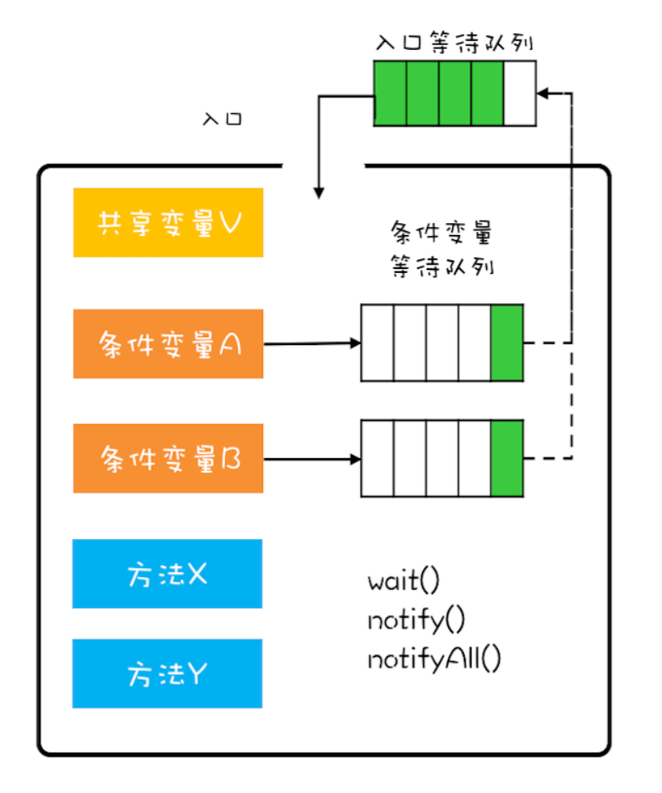

wait方法的调用必须在while循环中，这是MESA模型特有的

notify何时可以用

1. 所有等待线程拥有相同的等待条件；
2. 所有等待线程被唤醒后，执行相同的操作；
3. 只需要唤醒一个线程。

Java内置的管程方案(synchronized)对MESA模型进行了精简，只允许一个条件变量，JUC中的管程支持多个条件变量

### 线程生命周期

通用生命周期

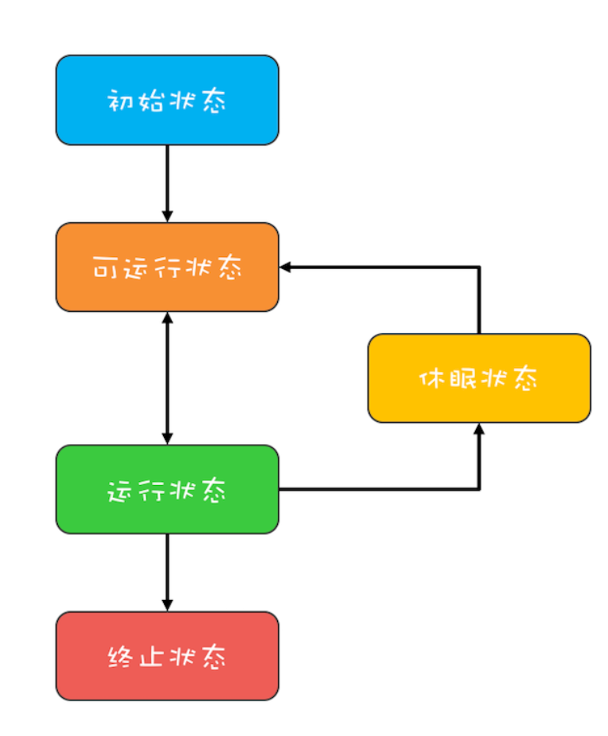

Java生命周期

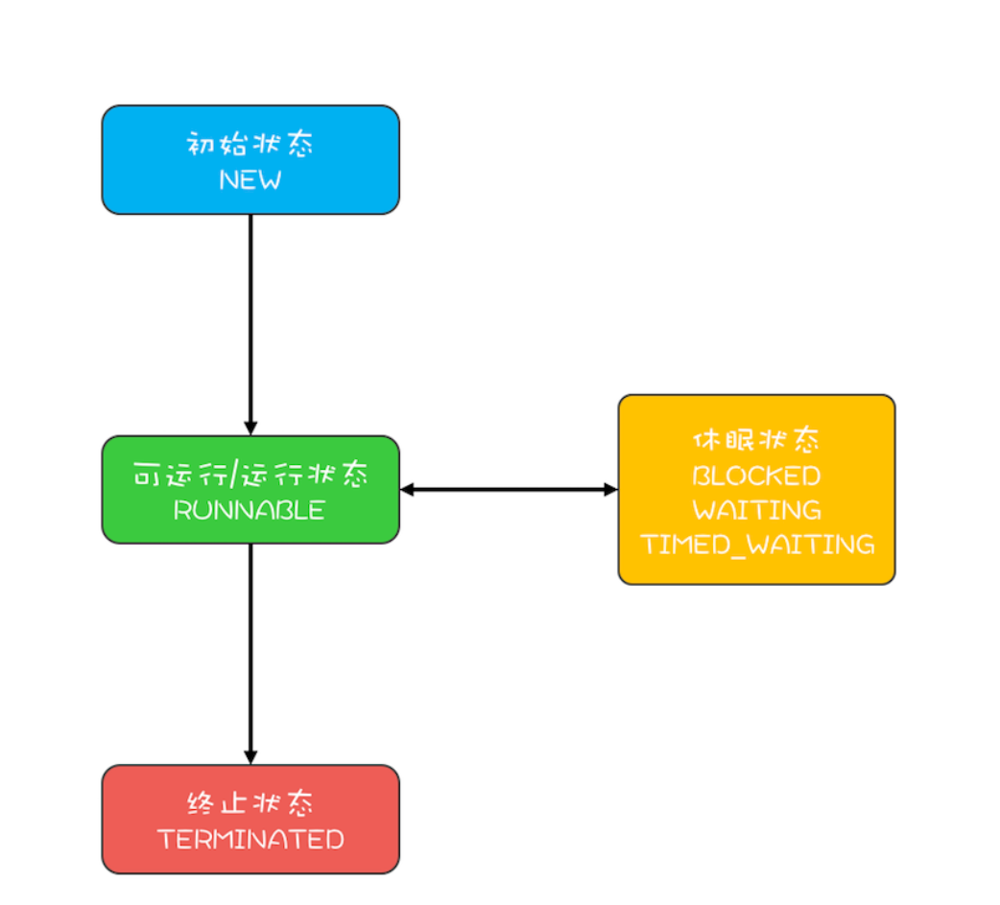

1. RUNNABLE与BLOCKED转换

    synchronized等待隐式锁进入BLOCKED状态，获得隐式锁进入RUNNABLE状态。

    JVM 层面并不关心操作系统调度相关的状态，因为在 JVM 看来，等待 CPU 使用权（操作系统层面此时处于可执行状态）与等待 I/O（操作系统层面此时处于休眠状态）没有区别，都是在等待某个资源，所以都归入了 RUNNABLE 状态。

2. RUNNABLE与WAITING转换

    获得 synchronized 隐式锁的线程，调用无参的Object.wait方法

    无参Thread.join方法

    无参LockSupport.park方法

3. RUNNABLE与TIMED_WAITING转换

    调用带超时参数的Thread.sleep(long mills)

    获得synchronized隐式锁的线程，调用带超时参数的Object.wait(long  timeout)方法

    调用带超时参数的 Thread.join(long millis) 方法；

    调用带超时参数的 LockSupport.parkNanos(Object blocker, long deadline) 方法；

    调用带超时参数的 LockSupport.parkUntil(long deadline) 方法。

4. NEW到RUNNABLE

    创建Thead对象，NEW状态。Thread.start，RUNNABLE状态

5. RUNNABLE到TERMINATED

    执行完run方法，或者抛出异常，导致TERMINATED

    interrupt方法

    当线程 A 处于 WAITING、TIMED_WAITING 状态时，如果其他线程调用线程 A 的 interrupt() 方法，会使线程 A 返回到 RUNNABLE 状态，同时线程 A 的代码会触发 InterruptedException 异常。

    当线程 A 处于 RUNNABLE 状态时，并且阻塞在 java.nio.channels.InterruptibleChannel 上时，如果其他线程调用线程 A 的 interrupt() 方法，线程 A 会触发 java.nio.channels.ClosedByInterruptException 这个异常；而阻塞在 java.nio.channels.Selector 上时，如果其他线程调用线程 A 的 interrupt() 方法，线程 A 的 java.nio.channels.Selector 会立即返回。
    
    主动检测  isInterrpted

stop、resume、suspend方法deprecated：会立即中断线程，但不释放锁

### 方法调用

方法调用过程：

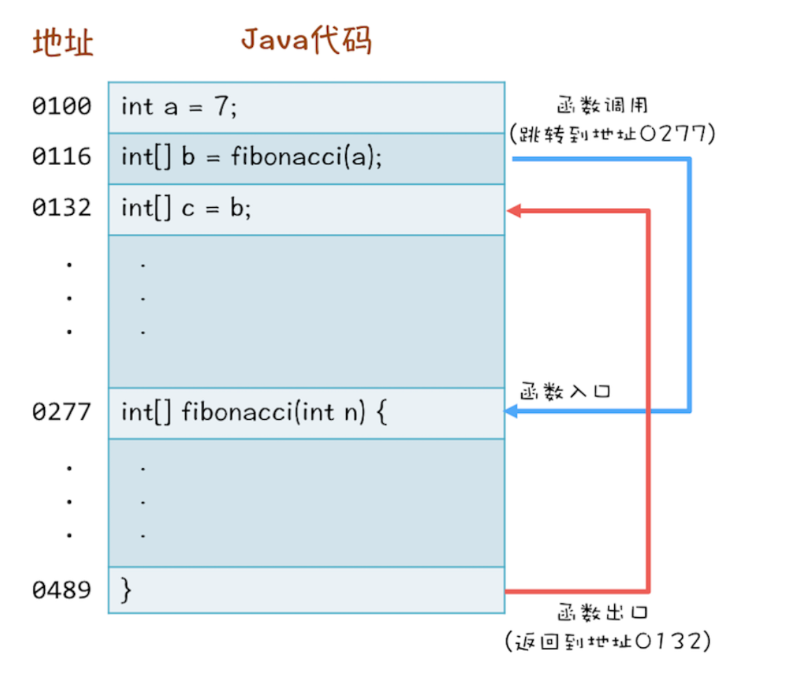

CPU通过堆栈寄存器找到调用方法的参数和返回地址，每个方法在调用栈里都有自己的独立空间，称为栈帧，栈帧和方法是同生共死的，每个线程都有自己的调用栈

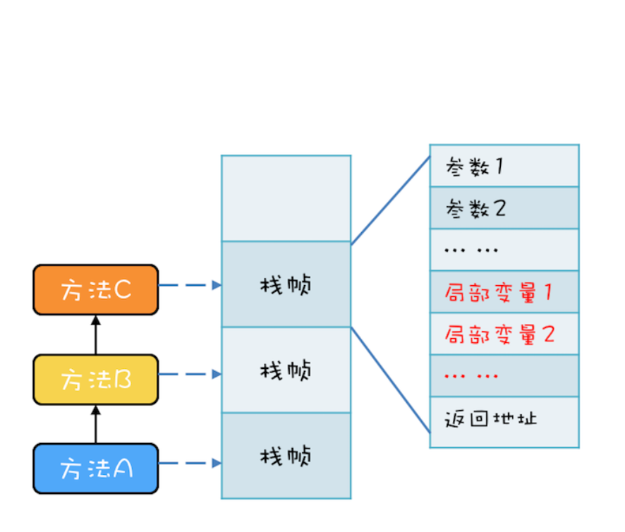

方法里的局部变量，因为不会和其他线程共享，所以没有并发问题，这种解决方案也被称为线程封闭，即仅在单线程内访问数据，不存在共享，没有并发问题

例：数据库连接池获取Connection

### 面向对象的思维进行并发编程

1. 封装共享变量，对公共访问方法制定并发访问策略
2. 识别共享变量之间的约束条件，如库存的上限要大于下限
3. 制定并发访问策略
    1. 避免共享，主要是线程本地存储或为每个任务单独分配线程
    2. 不变模式，在Java领域应用较少，如 Actor 模式、CSP 模式以及函数式编程的基础都是不变模式。
    3. 管程及其他同步工具

优先使用成熟的工具类

迫不得已才使用低级的同步原语：如synchronized、Lock、Semaphore

避免过早优化，安全优先

### 并发工具类

#### Lock和Condition

Java SDK 并发包通过 Lock 和 Condition 两个接口来实现管程，其中 Lock 用于解决互斥问题，Condition 用于解决同步问题

为什么有了synchronized还要有Lock和Condition

死锁问题破坏不可抢占条件，synchronized无法做到，申请不到资源直接阻塞

而Lock有三种方案可以解决

1. 响应中断  lock.lockInterruptibly()
2. 支持超时  lock.tryLock(long time, TimeUnit unit) 
3. 非阻塞获取锁 lock.tryLock()，获取不到锁直接返回，而不是进入阻塞状态

锁如何保证可见性：利用了volitile，如ReentrantLock内部有一个volitile的变量state，在lock和unlock时都会读写state

#### 可重入锁

ReentrantLock

线程可以重复获取同一把锁，如果是不可重入的锁，第二次获取锁时会阻塞

可重入函数，指的是多个线程可以同时调用该函数，每个线程都能得到正确结果，可重入函数是线程安全的

#### 公平锁和非公平锁

构造ReentrantLock可以传入一个fair参数，为true就是公平锁，反之为非公平锁

锁对应着一个入口等待队列，如果一个线程没有获得锁，就会进入等待队列，当有线程释放锁的时候，就需要从等待队列中唤醒一个等待的线程。如果是公平锁，唤醒的策略就是谁等待的时间长，就唤醒谁；如果是非公平锁，则不提供这个公平保证，如果锁被释放，有一个线程获取锁，可以不入队直接获取，获取不到才入队

#### 用锁的最佳实践

1. 永远只在更新对象的成员变量时加锁
2. 永远只在访问可变的成员变量时加锁
3. 永远不在调用其他对象的方法时加锁

#### 同步 异步 阻塞 非阻塞

同步与异步描述的是通信模式，阻塞与非阻塞描述的是线程处理模式

如A调用B：

如果是同步，B在接到A的调用后，会立即执行要做的事。A的本次调用可以得到结果

如果是异步，B在接到A的调用后，不保证会立即执行要做的事，但是保证会去做，B在做好了之后会通知A，A的本次调用得不到结果

如果是阻塞，A在发出调用后，要一直等待，等着B返回结果

如果是非阻塞，A在发出调用后，不需要等待，可以去做自己的事情

#### 信号量

Semaphore

一个计数器、一个等待队列、三个方法

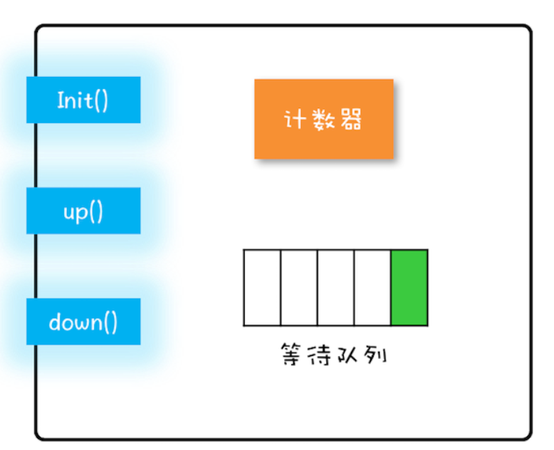

- init()：设置计数器的初始值。
- down()：计数器的值减 1；如果此时计数器的值< 0，则当前线程将被阻塞，否则当前线程可以继续执行。
- up()：计数器的值加 1；如果此时计数器的值<= 0，则唤醒等待队列中的一个线程，并将其从等待队列中移除。

down和up方法又被称为PV操作，Java SDK 并发包里，down() 和 up() 对应的则是 acquire() 和 release()。

#### ReadWriteLock

读多写少   读锁、写锁

1. 允许多个线程同时读共享变量；
2. 只允许一个线程写共享变量；
3. 如果一个写线程正在执行写操作，此时禁止读线程读共享变量。

ReentrantReadWriteLock

锁的升级与降级

先获取读锁，在未释放的情况下获取写锁，这种情况叫做锁的升级，但是读写锁不支持锁的升级，会导致写锁永久阻塞

但是锁的降级是可以的，即先获取写锁的情况下可以获取读锁

读锁不支持条件变量，会抛出异常

#### StampedLock

读多写少  比ReadWriteLock性能更高  但不支持重入  支持锁的升级和降级

写锁、悲观读锁、乐观读，  写锁和悲观读锁都不支持条件变量

写锁和悲观读锁语义上和读写锁的写锁和读锁一致，但是StampedLock会返回一个stamp，在解锁时需要传入stamp

乐观读：无锁，允许在多个线程读的时候，有一个线程可以获取写锁

如果线程阻塞在readLock或writeLock，调用该线程的interrupt方法会导致CPU飙升，如果需要支持中断，使用readLockInterruptibly和writeLockInterruptibly

#### CountDownLatch  CyclicBarrier

CountDownLatch 计数器，countDown将count减1， await等待count减为0，解决一个线程等待多个线程的场景，但其不能重复使用

CyclicBarrier适用于一组线程间互相等待的场景，可以重复使用，计数器减到0后恢复初始值

#### 并发容器

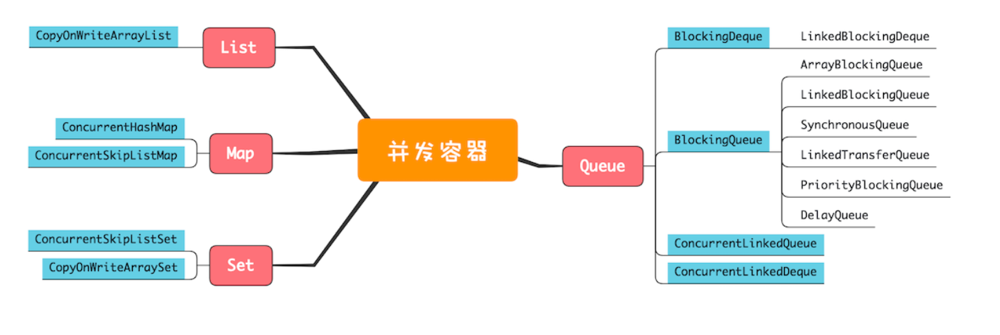

Collections.synchronizedList、synchronizedMap、synchronizedSet

使用iterator遍历是线程不安全的，涉及到组合操作，有竞态条件，需要加锁

**CopyOnWriteArrayList**

内部有一个array，读操作完全无锁，在写操作时，会生成一个新的array，最后将新生成的array赋值给内部的array

适用于写操作非常少的场景，且能忍受短暂的读写不一致，其iterator只是遍历快照，不支持增删改

**ConcurrentHashMap   ConcurrentSkipHashMap**

ConcurrentHashMap的key是无序的，ConcurrentSkipHashMap的key是有序的

键值都不允许为null

**Queue**

只有ArrayBlockingQueue和LinkedBlockingQueue支持有界，其余全是无界

#### 原子类

无锁

基于硬件CAS指令  compar and swap

CAS 指令包含 3 个参数：共享变量的内存地址 A、用于比较的值 B 和共享变量的新值 C；并且只有当内存中地址 A 处的值等于 B 时，才能将内存中地址 A 处的值更新为新值 C。CAS是一条指令，本身是原子的

CAS一般会伴随自旋，即循环尝试。若CAS的返回值不等于B，重新赋值B，并计算C，再次执行CAS，知道返回值等于B

ABA问题：线程1的B为x，根据B计算出C后，在判断是否需要自旋前，线程2将A更新为x+1，线程3将A更新为x，

#### 线程池

线程池的使用方是生产者，线程池本身是消费者

**ThreadPoolExecutor**

corePoolSize：最小线程数

maximumPoolSize：最大线程数

keepAliveTime & unit：如果一个线程空闲了keepAliveTime & unit这么久，而且线程池的线程数大于 corePoolSize ，这个线程要被回收

workingQueue：工作队列

threadFactory：自定义如何创建线程，如自定义线程名称

handler：拒绝策略。线程池中所有任务都在工作，并且工作队列也满了，会执行拒绝策略

* CallerRunsPolicy：提交任务的线程自己去执行该任务。

- AbortPolicy：默认的拒绝策略，会 throws RejectedExecutionException。
- DiscardPolicy：直接丢弃任务，没有任何异常抛出。
- DiscardOldestPolicy：丢弃最老的任务，其实就是把最早进入工作队列的任务丢弃，然后把新任务加入到工作队列。

allowCoreThreadTimeOut，让所有线程支持超时。

Executors：不推荐使用，大部分方法默认都使用无界的LinkedBlockingQueue，很容易导致OOM

#### Future

获取任务的执行结果，线程池execute无返回值，而submit方法可以返回Future

Future<?> submit(Runnable task);    Future\<T\> submit(Callable\<T\> task);  Future\<T\> submit(Runnable task, T result);

FutureTask 实现了Runnable和Future接口

#### CompletableFuture

runAsync(Runnable runnable)

supplyAsync(Supplier\<U\> supplier)

这两个方法都可以提供自己的线程池，缺省时会使用公共的默认ForkJoinPool，其默认线程数为CPU核数，建议自己根据需求创建不同的线程池，避免互相干扰

CompletionStage接口

描述任务的时序关系

1. 串行           thenApply、thenCompose、thenRun、thenAccept
2. AND          thenCombine、thenAcceptBoth 和 runAfterBoth 
3. OR             applyToEither、acceptEither 和 runAfterEither
4. 异常处理   exceptionally、whenComplete、handle

#### CompletionService

### 并发设计模式

#### Immutability模式

对象一旦创建后，状态不发生变化，这样就不存在并发问题

不可变的类：类的属性都是final的，方法都是只读的，类最好是final的，JDK中String、基本类型包装类都是不可变类

String和基本类的包装类的变量不适合做锁，因为String有字符串池，基本类型包装类也有Cache

#### CopyOnWrite模式

写时复制，不可变对象的写操作往往都是使用COW解决的，但容易消耗内存，每次修改都会创建新的对象

最大应用领域在函数式编程，函数式编程的基础就是不可变性

Unix创建进程使用了COW，文件系统Btrfs、aufs也都用到了COW，Docker容器景象的设计也是COW

#### 线程本地模式

没有共享，就没有并发问题    ThreadLocal

Thread内部有一个ThreadLocalMap，key为ThreadLocal，value为ThreadLocal泛型的值

这样做不容易内存泄漏：ThreadLocalMap对ThreadLocal是WeakReference，如果Thread被回收，ThreadLocalMap也可以被回收，若是在ThreadLocal中有个Map，key为Thread，导致Thread对象无法被回收，导致内存泄漏

ThreadLocalMap 中的 Entry 对 ThreadLocal 是弱引用（WeakReference），所以只要 ThreadLocal 结束了自己的生命周期是可以被回收掉的。但是 Entry 中的 Value 却是被 Entry 强引用的，所以即便 Value 的生命周期结束了，Value 也是无法被回收的，从而导致内存泄露，使用try finally手动remove

InheritableThreadLocal

#### Guarded Suspension保护性暂停

也被称为 Guarded Wait 模式、Spin Lock 模式

用于异步转同步

GuardedObject，内部有一个成员变量object，两个成员方法——get(Predicate\<T\> p)和onChanged(T obj)方法

```java
class GuardedObject<T>{
  // 受保护的对象
  T obj;
  final Lock lock = new ReentrantLock();
  final Condition done = lock.newCondition();
  final int timeout=1;
  // 获取受保护对象  
  T get(Predicate<T> p) {
    lock.lock();
    try {
      //MESA 管程推荐写法
      while(!p.test(obj)){
        done.await(timeout, TimeUnit.SECONDS);
      }
    }catch(InterruptedException e){
      throw new RuntimeException(e);
    }finally{
      lock.unlock();
    }
    // 返回非空的受保护对象
    return obj;
  }
  // 事件通知方法
  void onChanged(T obj) {
    lock.lock();
    try {
      this.obj = obj;
      done.signalAll();
    } finally {
      lock.unlock();
    }
  }
}
```

#### Balking模式

与Guarded Suspension模式不同，Balking在条件为false时直接返回，如DCL

#### Thread Per Message模式

为每个任务分配一个独立的线程，如HTTP请求，主线程接收到一个请求就生成一个线程去处理该请求

但是创建线程是重量级的，成本很高，而线程池又会增加复杂度，业界有另一种Java暂未支持的方案：轻量级线程，如Go语言的协程，创建成本低，创建速度和内存占用相比操作系统线程至少提升了一个数量级，OpenJDK有个Loom项目，就是为了解决Java的轻量级线程的问题，在Loom中，轻量级线程被叫做Fiber

#### Worker Thread模式

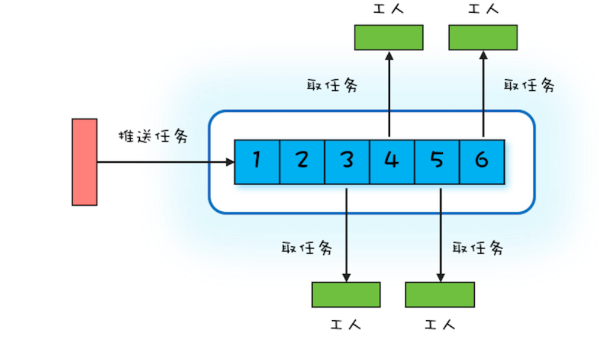

#### 两阶段终止模式

优雅的停止线程

第一阶段T1向T2发送终止指令，第二阶段T2响应终止指令

Java通过interrupt方法和终止标志位实现

线程池的shutdown和shutdownNow

shutdown方法只会让线程池拒绝接受新任务，但是已有的任务必须执行完毕才最终关闭线程池

shutdownNow让线程池拒绝接受新任务，并中断线程池中正在执行的任务，已经进入队列的任务不在执行，并作为方法返回值

#### 生产者消费者模式

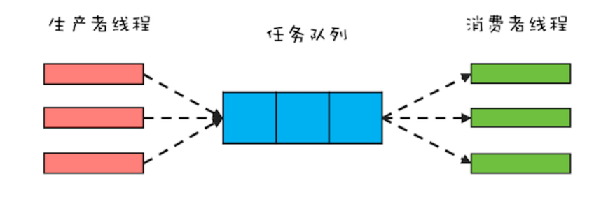

线程池就是生产者消费者模式

支持异步，能平衡生产者和消费者之间的速度差异

### 守护线程

Daemon   setDaemon(true)

当进程中不存在非守护线程了，则守护线程自动销毁。典型的守护线程就是垃圾回收线程

### 进程和线程

不同的进程间通过一些粗力度的通信机制交换数据，如套接字、信号处理器、共享内存、信号量、文件等

线程共享进程内的资源，但每个线程都有自己的程序计数器、栈、局部变量

操作系统调度的基本单位：线程   操作系统资源分配和独立运行的最小单位：进程

无状态对象一定是线程安全的

管程模型  信号量模型

#### 协程

#### 纤程

synchronized实现与优化

wait和sleep的区别

线程如何暂停和停止

线程安全  线程安全方法  线程安全类    不可变对象线程安全？    