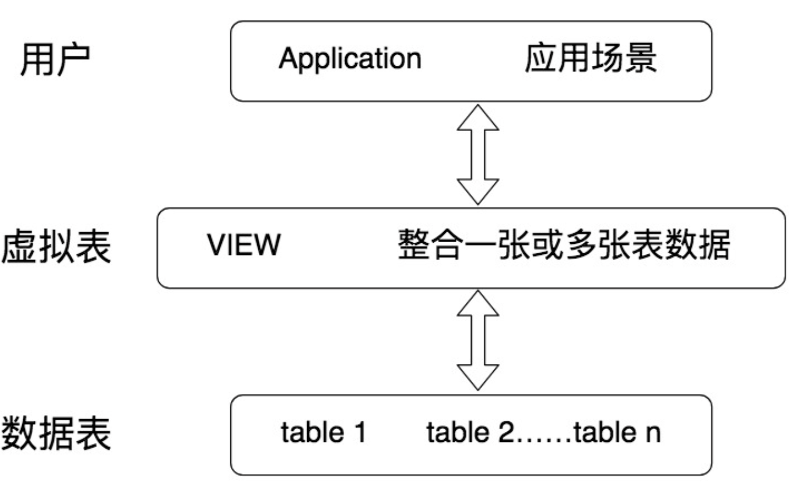

### Overview

SQL92和SQL99

ER图：实体、属性、关系

SQL按照功能划分为四个部分

* DDL：数据定义语言，创建、删除、修改数据库或表结构
* DML：数据操作语言，如插入、删除、修改
* DCL：数据控制语言，如控制访问权限和安全级别
* DQL：数据查询语言

规范：

* 表名、表别名、字段名、字段别名使用小写，字段名推荐下划线
* SQL保留字、函数、绑定变量等使用大写

DB：数据库，存储数据的集合

DBMS：数据库管理系统，多个DB + 管理程序

DBS：数据库系统，更大的概念，包含DB、DBMS、DBA

RDBMS：关系型数据库，SQL就是关系型数据库的查询语言

NoSQL泛指非关系型数据库，如键值型Redis、文档型MongoDB、搜索引擎ES Splunk Solr、列存储、图数据库等

搜索引擎的核心原理是倒排索引，用来实现全文检索

列数据库：降低系统IO，适合分布式文件系统，但功能相对有限

### DDL

CREATE  DROP  ALTER

int(11) 代表整数类型，显示长度为11位，括号中的参数 11 代表的是最大有效显示长度，与类型包含的数值范围大小无关

ALTER TABLE player ADD （age int）

ALTER TABLE player MODIFY （age  bigint）

ALTER TABLE player DROP COLUMN age

ALTER TABLE player RENAME COLUMN age to play_age

表设计原则：简单可复用，简单指的是用更少的表、更少的字段、更少的联合主键字段来完成数据表的设计。可复用则是通过主键、外键的使用来增强数据表之间的复用率

#### 约束

- 键约束
    - 主键约束：主键不可以重复，不可以为空
    - 外键约束：外键可以重复，可以为空
- 字段约束
    - unique约束：同时会创建普通索引（normal index）
    - not null约束
    - default约束
    - check约束：check（age >= 18 and age <= 70）

### DQL

SELECT [distinct]... FROM ... WHERE ... GROUP BY ... HAVING ... ORDER BY ...

FROM > WHERE > GROUP BY > HAVING > SELECT 的字段 > DISTINCT > ORDER BY > LIMIT

多张表join

1. 首先先通过 CROSS JOIN 求笛卡尔积，相当于得到虚拟表 vt（virtual table）1-1；
2. 通过 ON 进行筛选，在虚拟表 vt1-1 的基础上进行筛选，得到虚拟表 vt1-2；
3. 添加外部行。如果我们使用的是左连接、右链接或者全连接，就会涉及到外部行，也就是在虚拟表 vt1-2 的基础上增加外部行，得到虚拟表 vt1-3。

as取别名   order by可以使用不在select中的字段    ASC   DESC

在知道返回结果只会有一个时 limit 1 提升查询效率 

#### where过滤

and、or、not、between and、like、is null、in、算术比较

% ：一个或多个字符   _ ：一个字符 

like以%开头，即使有索引也会进行全表扫描，不以%开头且有索引，不会进行全表扫描

聚集函数：count max min avg sum

count(*) = count(1) > count(字段)   count(字段) 会忽略null

#### 子查询

关联子查询：循环执行

非关联子查询：只执行一次

exists   in：是否在集合中   any：和比较操作符一起用    all：和比较操作符一起用

在建立索引的情况下，exists和in效率

select * from a where x in (select x from b)          select * from a where exists (select x from b where a.x = b.x)

若A表比B表大，使用in，使用B表的索引

若A表比B表小，使用exists，使用A表的索引

#### 函数

函数会导致不走索引，不要在where中使用函数

* 算术函数
* 字符串函数
* 日期函数
* 转换函数

#### 表连接

##### 笛卡尔积 / Cross Join

X表每一行和Y表每一行两两相连，结果集的数量为X * Y

SQL92    select * from a,b

SQL99    select * from a cross join b

##### 等值连接 / 自然连接

使用两张表中都存在的列先笛卡尔积，在判断等值，自然连接会将两个表中名称相同的字段进行等值比较

SQL92    select * from a,b where a.id = b.id

SQL99    select * from a natural join b   /    select * from a join b on a.id = b.id  /  select * from a join b using(id)

##### 非等值连接

用等号判断连接的就是等值连接，其余的判断条件就是非等值连接

##### 外连接

左外连接：左边的表位主表，显示其全部行   (+)表示其为从表

SQL92      select * from a，b where a.id = b.id(+)     

SQL99      select * from a left join b on a.id = b.id

右外连接：右边的表为主表，显示其全部行  (+)表示其为从表

SQL92      select * from a，b where a.id(+) = b.id  

SQL99      select * from a right join b on a.id = b.id

全外连接： 两边的表都显示其全部行

SQL99      select * from a full join b on a.id = b.id

Mysql不支持全外连接

##### 自连接

查询条件使用了当前表的字段

##### 总结

1. 内连接：将多个表之间满足连接条件的数据行查询出来。它包括了等值连接、非等值连接和自连接。
2. 外连接：会返回一个表中的所有记录，以及另一个表中匹配的行。它包括了左外连接、右外连接和全连接。
3. 交叉连接：也称为笛卡尔积，返回左表中每一行与右表中每一行的组合。在 SQL99 中使用的 CROSS JOIN。

### 视图

视图：虚拟表，相当于一张表或多张表的结果集

create view  viewname as select ...

alter view viewname as select ...

drop view viewname

### DCL

### DML

### 事务隔离

### 存储过程

