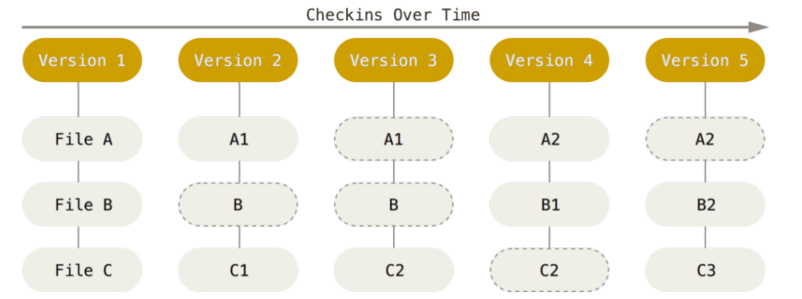
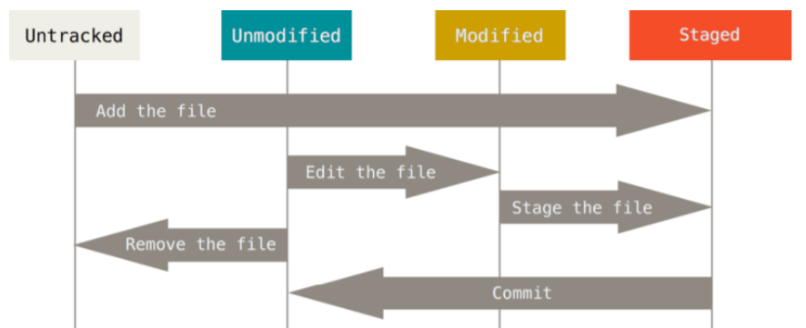
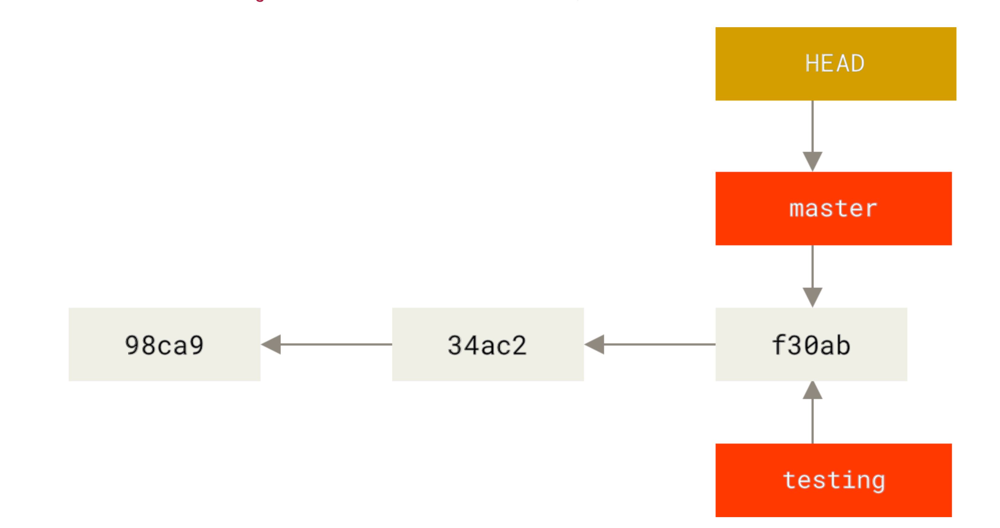
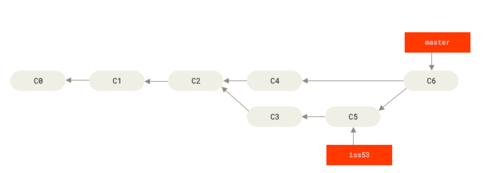
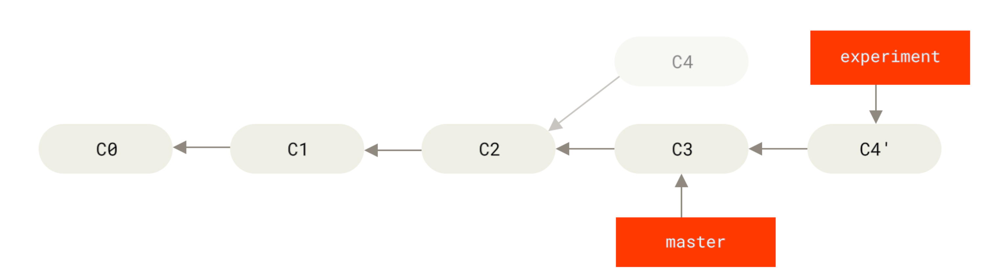
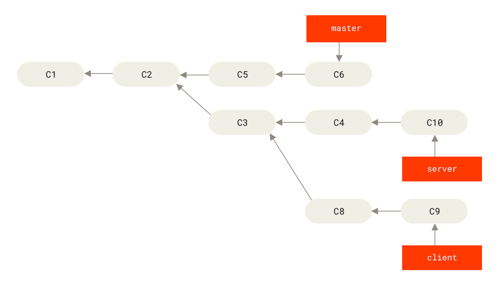
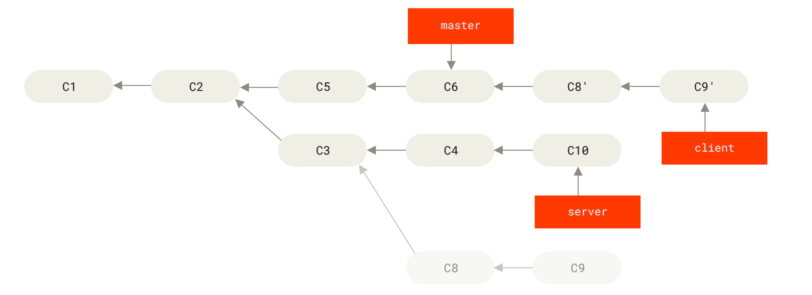

### Git简史

* 速度
* 简单的设计
* 对非线性开发模式的强力支持（允许成千上万个并行开发的分支）
* 完全分布式
* 有能力高效管理类似 Linux 内核一样的超大规模项目（速度和数据量）

### Git基础

#### 直接记录快照，而非差异比较

每次你提交更新，或在 Git 中保存项目状态时，它主要对当时的全部文件制作一个快照并保存这个快照的索引。 为了高效， 如果文件没有修改，Git 不再重新存储该文件，而是只保留一个链接指向之前存储的文件。 Git 对待数据更像是一个快照流



#### Git保证完整性

计算校验和    SHA-1散列  由40个16进制字符组成的字符串

实际上，Git 数据库中保存的信息都是以文件内容的哈希值来索引，而不是文件名

#### 三种状态

Git有三种状态，已提交（committed）、已修改（modified）、已暂存（staged）

已提交表示数据已经安全的 保存在本地数据库中。 已修改表示修改了文件，但还没保存到数据库中。 已暂存表示对一个已修改文件的当前 版本做了标记，使之包含在下次提交的快照中

Git三个工作区域：Git仓库、工作目录、暂存区域


### Git配置

git config:

1.  /etc/gitconfig 文件: 仓库的通用配置。 使用带有 --system 选项的 git config 时，会从此文件读写配置变量    
2. ~/.gitconfig 或 ~/.config/git/config 文件：只针对当前用户。 可以传递 --global 选项让 Git 读写此文件
3. 当前使用仓库的 Git 目录中的 config 文件（ .git/config）：针对该仓库。 

 每一个级别覆盖上一级别的配置，所以 .git/config 的配置变量会覆盖 /etc/gitconfig 中的配置变量

```shell
$ git config --global user.name "John Doe"
$ git config --global user.email johndoe@example.com
$ git config --list  --show-origin
$ git config --unset
```

### Git命令



Git有一个HEAD指针指向当前版本，上一个版本为HEAD^  上上个版本为HEAD^^   回退50个版本  HEAD~50

#### gitignore

文件 .gitignore 的格式规范如下：

* 所有空行或者以 ＃ 开头的行都会被 Git 忽略。 

* 可以使用标准的 glob 模式匹配。
* 匹配模式可以以（/）开头防止递归。 
* 匹配模式可以以（/）结尾指定目录。 
* 要忽略指定模式以外的文件或目录，可以在模式前加上惊叹号（!）取反。

所谓的 glob 模式是指 shell 所使用的简化了的正则表达式

 \* 匹配零个或多个任意字符；[abc] 匹配任何一个在方括号中的字符；? 只匹配一个任意字符；如果在方括号中使用短划线分隔两个字符，表示所有在这两个字符范围内的都可以匹配 （比如 [0-9] 表示匹配所有 0 到 9 的数字）。 使用两个星号（*) 表示匹配任意中间目录，比如 a/**/z 可以匹 配 a/z , a/b/z 或 a/b/c/z 等。

### Git标签

轻量标签   git tag name \<commit\>

附注标签   git tag -a name -m msg  \<commit\>

git push \<remote\> --tags

git push origin --delete \<tagname\>

### Git分支

commit tree blob



git branch name  \<commit\>

git checkout -b name \<commit\>

git merge name

git branch -u origin/abc   设置当前分支跟踪origin的abc分支

git push origin abc:def   将本地abc分支提交到远程def分支

git push origin --delete \<branch>

FAST-FORWARD：当你试图合并分支时，如果顺着当前分支走下去能够到达另一个分支，那么 Git 在合并两者的时候， 只会简单的将指针向前推进 (指针右移)，因为这种情况下的合并操作没有需要解决的分歧——这就叫做 “快进(fast-forward)”。




### 变基

rebase： 将提交到某一分支上的所有修改都移至另一分支上

git rebase maset experiment

git rebase master



它的原理是首先找到这两个分支(即当前分支 experiment、变基操作的目标基底分支 master) 的最近共同祖先 C2，然后对比当前分支相对于该祖先的历次提交，提取相应的修改并存为临时文件， 然后将当前分支指向目标基底 C3, 最后以此将之前另存为临时文件的修改依序应用。



git rebase --onto master server client   取出client，找出它从server分离出来的提交，将其rebase到master




### 协议

哑协议和智能协议(file:///     http/https       ssh)

哑协议传输进度不可见，速度慢，智能协议相反

### 在服务器上使用Git

1. 安装git
2. 创建git用户

```shell
adduser git
vi /etc/passwd   
git:x:1001:1001:,,,:/home/git:/bin/bash 替换为
git:x:1001:1001:,,,:/home/git:/bin/git-shell
passwd git 123456
```

3. ssh

```shell
cd ～/.ssh
vi authorized_keys
```

4. 创建文件夹并赋予权限

```shell
mkdir git
chown -R git:git git
chmod 777 git
```

5. 初始化仓库及克隆

```shell
cd git
git init --bare xxx.git
git clone git@127.0.0.1:/path/git/xxx.git
```

