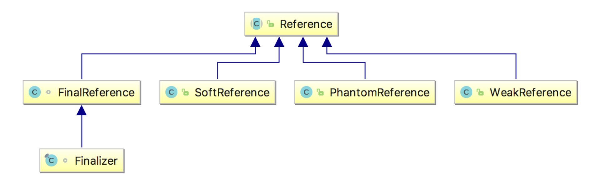

# 引用

## StrongReference

我们平时开发中new一个对象出来，这种引用便是强引用。 JVM 系统采用 Finalizer 来管理每个强引用对象 , 并将其被标记要清理时加入 ReferenceQueue, 并逐一调用该对象的 finalize() 方法。

## SoftReference

当内存足够的时候，软引用所指向的对象没有其他强引用指向的话，GC的时候并不会被回收，当且只当内存不够时才会被GC回收（调用finalize方法）。强度仅次于强引用。

## WeakReference

弱引用指向的对象没有任何强引用指向的话，GC的时候会进行回收。

## PhantomReference

如果一个对象仅持有虚引用，那么它就和没有任何引用一样，在任何时候都可能被垃圾回收器回收。