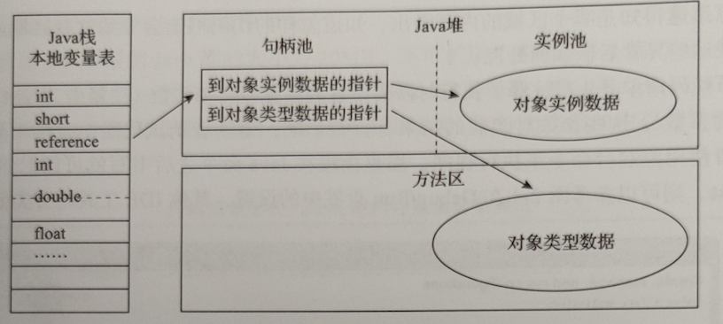
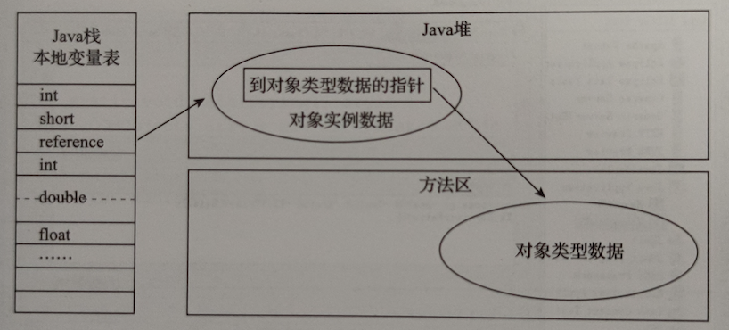

# 对象

针对Hotspot虚拟机

## 对象的内存布局

对象头、实例数据、对其填充(Padding)

对象头包含两类信息

第一类用于存储对象自身的运行时数据，如哈希码、GC分代年龄、锁状态标志、线程持有的锁、偏向线程ID、偏向时间戳等，在未开启压缩指针的虚拟机里，这部分数据的长度等于虚拟机的位数，如64位虚拟机对应64个比特，官方称这部分为Mark Word

第二类是类型指针，即指向对象类型元数据的指针。并不是所有的虚拟机都要在对象数据上保留类型指针，即查找对象的元数据信息不一定要经过对象本身，如果对象是数组，对象头还要记录数组的长度

实例数据存储顺序受虚拟机分配策略(-XX:FieldAllocationStyle)和生命顺序影响，Hotspot默认分配顺序为longs/doubles、ints、shorts/chars、bytes/booleans、OOPs(Ordinal Object Pointer)，相同宽度的字段总是被分配到一起存放，在此条件的前提下，父类中定义的变量出现在自类之前，如果设置-XX:CompactFields为true，子类中较窄的变量也允许插入父类变量的空隙之中

Hotspot虚拟机自动内存管理要求对象的大小必须是8字节的整数倍，对象头已经被精心设计为8字节的1倍或2倍，在实例数据没有对齐，需要通过对齐填充来补全

## 对象的创建

除了clone和反序列化外，创建对象通常是new指令，JVM会首先检查指令参数能否在常量池中定位到一个类的引用，并检查这个类是否被加载链接和初始化

对象所需内存在类加载完成后便可完全确定，如果堆内存是规整的，分配内存就是将指针向空闲内存移动对象大小相同的距离，这种方式被称为指针碰撞Bump The Pointer；如果不是规整的，虚拟机要维护一个可用内存的列表，找到一块足够大的空间划分给对象实例，并更新记录，这种方式成为空闲列表Free List。Java堆的规整由采用的垃圾收集器是否带有空间压缩整理Compact的能力决定，Serial、ParNew等收集器，采用的分配算法是指针碰撞，而CMS理论上只能通过复杂的空闲列表来分配内存，但在CMS的实现里，为了能在大多数情况下分配的更快，设计了一个Linear Allocation Buffer，通过空闲列表拿到一大块分配缓冲区，在它里面仍可使用指针碰撞方式

对象内存分配的并发问题：一：对分配空间进行同步控制，虚拟机采用CAS和失败重试的方式保证更新操作的原子性；二：TLAB，本地线程分配缓冲，当TLAB用完了分配新的缓冲区的时候才进行同步，可通过-XX:+UseTLAB来启用

内存分配完成后，将除了对象头外的内存空间初始化为0，接下来对对象的对象头进行必要设置，根据虚拟机运行状态的不同，如是否启用偏向锁，对象头会有不同的设置方法

调用构造函数

## 对象的访问定位

虚拟机规范并没有规定如何通过栈上的reference找到具体对象，主流方式有句柄和直接指针两种

使用句柄最大的好处是在对象移动时，只会改变句柄的实例数据指针，reference本身不需要修改

使用直接指针最大的好处是速度更快

在Hotspot中，主要使用直接指针进行对象访问，但使用Shenandoah收集器的话会有例外